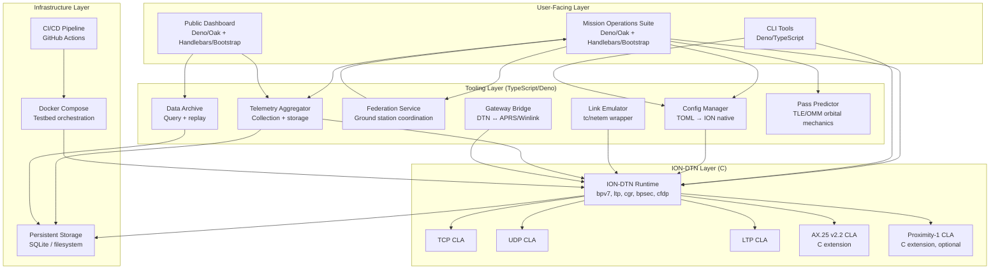
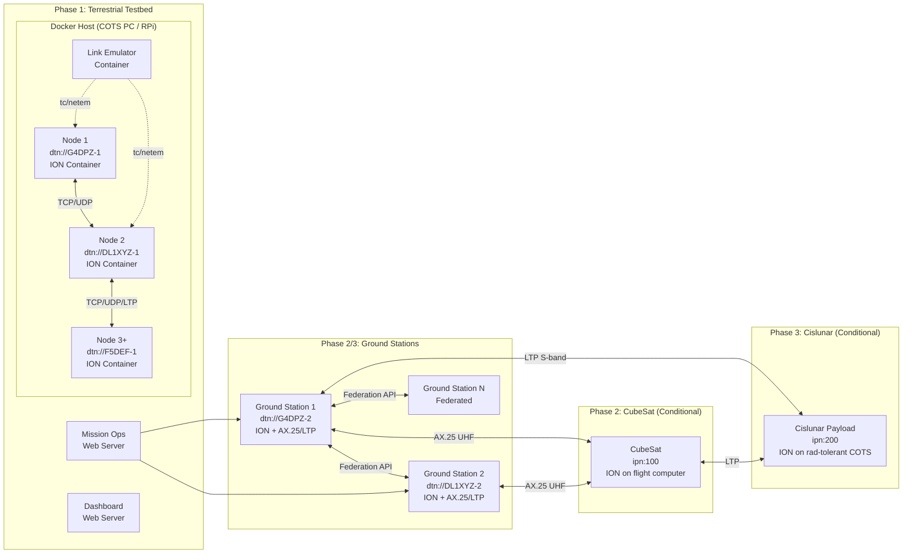
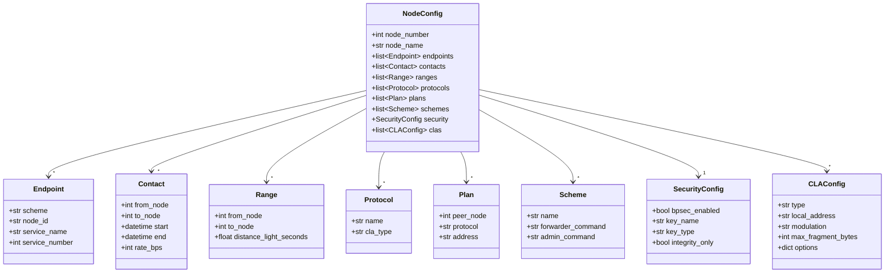
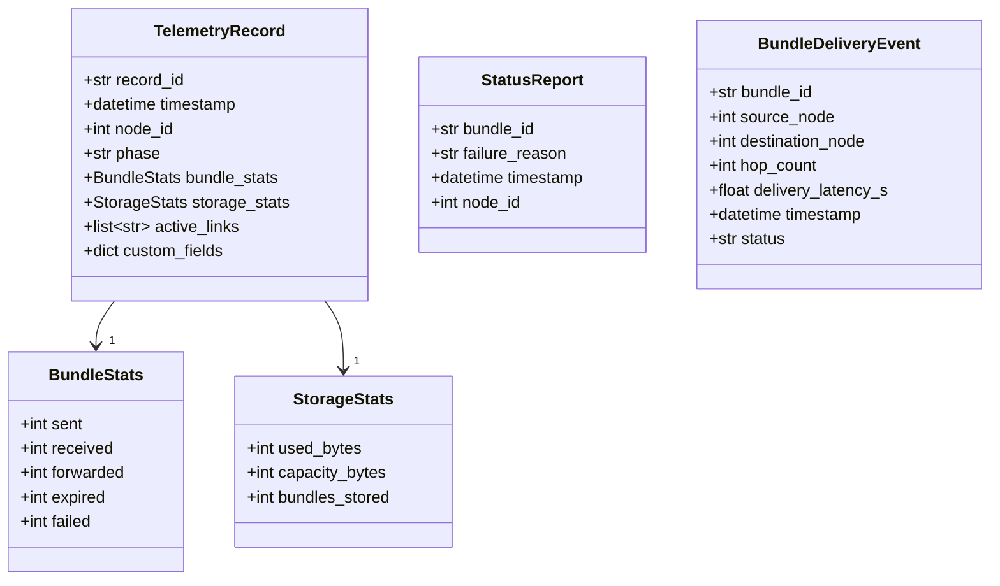

# Design Document: ION-DTN Cislunar Demonstration

| | |
|---|---|
| Document ID | ION-DTN-DES-001 |
| Version | 0.1.0 |
| Status | Draft |
| Classification | Public |
| Licence | Apache License, Version 2.0 |

## Document Control

### Authorship

| Role | Name | Organisation |
|------|------|-------------|
| Lead Author | [name] | AMSAT-UK |
| Contributing Author | [name] | AMSAT-DL |
| Technical Review | [name] | [organisation] |

### Change History

| Version | Date | Author | Description |
|---------|------|--------|-------------|
| 0.1.0 | 2026-03-28 | [name] | Initial draft — 12 components, 65 correctness properties, full data models and testing strategy |

### Distribution

This document is released under the Apache License, Version 2.0 and may be freely distributed.

### Review and Approval

| Action | Name | Date | Signature |
|--------|------|------|-----------|
| Prepared by | [name] | | |
| Reviewed by | [name] | | |
| Approved by | [name] | | |

---

## Overview

This design describes the software architecture for a phased ION-DTN demonstration project progressing from a terrestrial testbed (Phase 1) through CubeSat integration (Phase 2, conditional on CubeSat host) to a cislunar payload (Phase 3, conditional on ESA ARTES approval). The system wraps NASA JPL's open-source ION (Interplanetary Overlay Network) implementation — the reference Bundle Protocol implementation — and extends it with custom tooling for configuration management, link emulation, mission operations, telemetry, federation, gateway bridging, and public engagement.

### Design Principles

- **Incremental deployment**: Each phase delivers standalone value. Phase 1 proceeds independently; Phases 2 and 3 build on Phase 1 but are not prerequisites for each other.
- **COTS accessibility**: All components run on commodity hardware (Raspberry Pi, SDR dongles, amateur transceivers) and open-source software.
- **Community reproducibility**: Every component is Apache 2.0 licensed, documented for amateur radio operators and undergraduate students, and testable without space hardware.
- **Correctness through testing**: TDD with property-based testing for protocol-level components, CI/CD pipelines, and minimum 80% code coverage.
- **Wrap, don't reimplement**: ION-DTN is the reference BP implementation. We wrap it with Deno/TypeScript tooling and extend it with C where needed, rather than reimplementing protocol logic.

### Key Design Decisions

| Decision | Rationale |
|----------|-----------|
| Wrap ION-DTN rather than reimplement | ION is the reference BP implementation (NASA JPL), already supports BPv7, CGR, LTP, BPSec, CFDP, and multiple CLAs. Reimplementation would be wasteful and error-prone. |
| TypeScript/Deno for all tooling, C for ION extensions | ION's core is C. All tooling (config management, link emulation, mission ops, dashboard, CLI, telemetry, federation, gateway, archive) uses Deno/TypeScript for a single consistent runtime. Any ION extensions (custom CLAs, protocol hooks) are written in C to match ION's codebase. This keeps the project to two languages: TypeScript and C. |
| TOML for our configuration layer | ION uses a multi-file native config format (.ionrc, .bprc, .ipnrc, .rc). We define a TOML-based configuration layer that is human-friendly and machine-parseable, with a compiler that generates ION's native config files. |
| Hybrid EID addressing (dtn:// + ipn:) | Terrestrial and ground station nodes use `dtn://` scheme with amateur radio callsign-SSID pairs following the APRS convention (e.g., `dtn://G4DPZ-1/inbox`, `dtn://G4DPZ-2/telemetry`), where the SSID distinguishes multiple nodes or services under the same callsign. CubeSat and cislunar payload nodes use `ipn:` scheme for compact, bandwidth-efficient addressing. ION's `dtn2` module handles the `dtn:` scheme; `ipn` module handles `ipn:`. Both schemes coexist in the same network via ION's multi-scheme support. |
| Docker for testbed deployment | Containerised nodes ensure reproducible deployment across different host systems. Each Docker container runs an ION node with its generated config. |
| Web-based mission ops and dashboard | Maximises accessibility — no native app installation. Deno with Oak framework for the backend, Handlebars for server-side templating, Bootstrap for responsive UI, SQLite for local state. |
| SQLite for all persistent storage | SQLite is zero-config, runs on Raspberry Pi, requires no separate database server, and is sufficient for telemetry, archive, federation, and audit data. Parquet export for bulk data analysis. |
| Point-to-point first, then multi-node | Phase 1 starts with a 2-node point-to-point topology (mirroring ION's `configs/2node-stcp/` pattern) before expanding to 3+ nodes for CGR validation. |

### ION-DTN Source Tree Reference

The design wraps the ION source tree (symlinked at `ION-DTN/` in the workspace, pointing to `../ION-DTN`):

```
ION-DTN/
├── bpv7/          # Bundle Protocol v7 (bpsec, cgr, daemon, stcp, tcp, udp, ltp, dtn2, ipn, ipnd, library, test, utils)
├── ltp/           # Licklider Transmission Protocol (daemon, library, udp, dccp, test, utils)
├── cfdp/          # CCSDS File Delivery Protocol (daemon, library, bp, tcp, test, utils)
├── ams/           # Asynchronous Message Service (library, rams, test, utils)
├── ici/           # Interplanetary Communication Infrastructure (core ION library)
├── configs/       # Example configurations (2node-stcp, 3node-stcp-ltp, 3node-ltp-brs, loopback)
├── demos/         # Benchmark and demo scripts
├── tests/         # Test suite
├── nm/            # Network Management
└── contrib/       # Community contributions
```

ION configuration uses a multi-file format per node:
- `.ionrc` — ION node initialisation, contacts, ranges
- `.bprc` — Bundle Protocol configuration (schemes, endpoints, protocols, plans)
- `.ipnrc` — IPN scheme routing rules
- `.rc` — Combined startup script sourcing the above

Example from `configs/2node-stcp/`: `host1.ionrc`, `host1.bprc`, `host1.ipnrc`, `host1.rc`, `host2.ionrc`, `host2.bprc`, `host2.ipnrc`, `host2.rc`.


## Phase 1 — Terrestrial Testbed Design

Phase 1 is the active, unconditional phase that delivers a ground-based ION-DTN network using COTS hardware and open-source software.

### Deployment

### Docker Compose Topologies

Phase 1 uses Docker Compose for reproducible testbed deployment on COTS hardware (commodity PCs, Raspberry Pi).

#### 2-Node Point-to-Point Topology

The testbed starts with a 2-node point-to-point configuration mirroring ION's `configs/2node-stcp/` example. This validates basic Bundle Protocol operation, bundle exchange, and store-and-forward behaviour before expanding to multi-node topologies.

```
docker/
├── docker-compose.2node.yml     # Point-to-point (Phase 1 start)
```

- Node 1: `dtn://G4DPZ-1` — ION container with STCP/TCP CLA
- Node 2: `dtn://DL1XYZ-1` — ION container with STCP/TCP CLA
- Inter-node link: TCP/UDP over Docker bridge network

#### 3-Node Multi-Hop Topology

After validating point-to-point, the testbed expands to 3+ nodes to exercise Contact Graph Routing multi-hop routing, similar to ION's `configs/3node-stcp-ltp/` example.

```
docker/
├── docker-compose.3node.yml     # Multi-hop CGR (Phase 1 expanded)
├── docker-compose.emulated.yml  # With link emulation profiles
```

- Node 1: `dtn://G4DPZ-1` — Source node
- Node 2: `dtn://DL1XYZ-1` — Relay node (CGR forwarding)
- Node 3: `dtn://F5DEF-1` — Destination node
- Link Emulator container applies `tc`/`netem` profiles to inter-node links

### Point-to-Point First Approach

Phase 1 follows a deliberate progression:

1. **2-node STCP**: Validate basic bundle exchange, store-and-forward, BPSec integrity
2. **2-node with disruption**: Add link disruption simulation, verify bundle storage and forwarding on restoration
3. **3-node CGR**: Add relay node, validate multi-hop Contact Graph Routing
4. **3-node with emulation**: Layer link emulation profiles (LEO, HEO, cislunar) on the 3-node topology
5. **AX.25 CLA**: Add AX.25 FM/AFSK 1200 baud links between nodes (terrestrial packet radio simulation)

### Link Emulation Profiles

Phase 1 provides four pre-built link emulation profiles stored as TOML files:

### `terrestrial_afsk.toml`
- Delay: <1ms
- Bandwidth: 1.2 kbps (FM/AFSK 1200 baud)
- Jitter: minimal
- Loss: 0.5%
- Disruption: none (continuous link)
- Purpose: Simulates terrestrial VHF packet radio links between amateur stations

### `leo_pass.toml`
- Delay: 5–15ms
- Bandwidth: 9.6 kbps (BPSK 9K6)
- Jitter: 2ms
- Loss: 1%
- Disruption: 10-minute pass with 80-minute gap (LEO orbital period)
- Purpose: Simulates a low Earth orbit amateur satellite pass

### `heo_pass.toml`
- Delay: 50–500ms (variable with orbital geometry)
- Bandwidth: 4.8 kbps
- Jitter: 10ms
- Loss: 2%
- Disruption: Long pass with variable geometry, periodic gaps
- Purpose: Simulates a highly elliptical orbit pass (e.g., Molniya-type)

### `cislunar.toml`
- Delay: 1300ms (one-way light delay to Moon)
- Bandwidth: 1 kbps (BPSK)
- Jitter: 20ms
- Loss: 0.5%
- Disruption: Periodic 45-minute lunar occlusion windows
- Purpose: Simulates cislunar link conditions for protocol validation before Phase 3

### Convergence Layer Adapters

Phase 1 uses the following CLAs:

| CLA | Protocol | Data Rate | Use Case |
|-----|----------|-----------|----------|
| TCP (STCP) | TCP/IP | Network speed | Primary inter-node transport in Docker testbed |
| UDP | UDP/IP | Network speed | Alternative transport for testing |
| AX.25 (FM/AFSK) | AX.25 v2.2 | 1200 baud | Terrestrial packet radio simulation (VHF 2m band) |
| Proximity-1 | CCSDS 211.0 | Configurable | Optional — short-range relay simulation |

The AX.25 CLA in Phase 1 uses FM/AFSK modulation at 1200 baud, simulating terrestrial VHF packet radio links. This exercises the custom AX.25 v2.2 CLA (C extension) and bundle fragmentation for constrained links before the higher-rate BPSK 9K6 mode is used in Phase 2.

### Testing

Phase 1 integration tests focus on:

### 2-Node Integration Tests
- Bundle exchange over STCP between two Docker containers
- Store-and-forward: send bundle during link disruption, verify delivery after restoration
- BPSec integrity verification end-to-end
- Configuration round-trip: TOML → ION native → start nodes → exchange bundles
- Bundle fragmentation over simulated AFSK 1200 baud link

### 3-Node Integration Tests
- Multi-hop CGR routing: bundle from Node 1 → Node 2 (relay) → Node 3
- CGR path selection with multiple available routes
- Link emulation profile application and measurement (delay, loss, bandwidth)
- Contact plan scheduling: bundles queued during no-contact, forwarded when contact opens
- Telemetry collection from all three nodes via aggregator

All Phase 1 tests run in Docker containers on COTS hardware without requiring physical radio equipment or space segment access.


## Phase 2 — CubeSat Design (Conditional on CubeSat Host)

Phase 2 is conditional on identifying and partnering with a suitable CubeSat project host.

### Deployment

### CubeSat Flight Computer

The CubeSat runs ION-DTN on a COTS flight computer. The ION-DTN payload is a software package running on the host CubeSat's flight computer with minimal additional hardware.

- **Platform:** COTS flight computer available to amateur satellite programmes
- **Operating System:** Linux (embedded)
- **ION-DTN:** Compiled from source for the target ARM/RISC-V architecture
- **Addressing:** `ipn:100` scheme for compact, bandwidth-efficient addressing

### Ground Station Bare Metal

Ground stations run ION-DTN on bare metal (Raspberry Pi or commodity PC) with amateur radio transceiver hardware:

- **Platform:** Raspberry Pi 4/5 or equivalent COTS PC
- **Transceiver:** UHF amateur radio transceiver (70 cm band, 430–440 MHz)
- **TNC:** Hardware or software TNC for AX.25 packet radio
- **Addressing:** `dtn://` scheme with callsign-SSID (e.g., `dtn://G4DPZ-2`)

### Convergence Layer Adapters

| CLA | Protocol | Data Rate | Use Case |
|-----|----------|-----------|----------|
| AX.25 v2.2 (BPSK 9K6) | AX.25 v2.2 | 9600 bps | CubeSat UHF uplink/downlink (70 cm band) |
| LTP | Licklider Transmission Protocol | Configurable | Ground-to-space reliable transport |

The AX.25 CLA in Phase 2 uses BPSK modulation at 9600 bps (9K6), the standard for modern amateur CubeSat communication. LTP provides reliable transport with retransmission management for the ground-to-space link.

### Resource Constraints

The CubeSat flight environment imposes strict resource constraints:

| Resource | Constraint | Design Impact |
|----------|-----------|---------------|
| Memory | 256 MB maximum | ION Bundle Agent memory footprint must stay within 256 MB under all workloads (Property 60) |
| Storage | 1 GB non-volatile minimum | Bundle store-and-forward buffer; must survive power cycles |
| Power | Variable (solar + battery) | Bundle Agent must recover gracefully after power loss (Property 61); checkpoint in-progress transfers |
| Link availability | ~10 min pass / ~80 min gap | Store-and-forward is primary operating mode; custody transfer ensures no bundle loss during intermittent contacts |

### Power Recovery

When the CubeSat loses power during a bundle transfer, the Bundle Agent must:
1. Persist transfer state to non-volatile storage at regular checkpoints
2. On power restoration, detect incomplete transfers
3. Resume pending transfers from the last checkpoint without data loss
4. Log the power loss event and recovery status

### Federation and Ground Station Coordination

Phase 2 introduces real multi-ground-station federation:

- Ground stations worldwide register with the Federation Service
- Pass predictions computed from TLE/OMM orbital elements for the CubeSat
- Pass assignments coordinated to avoid redundant transmissions when multiple stations have overlapping visibility
- Transfer logs maintained at each ground station recording bundle identifiers, timestamps, transfer status, and byte counts per pass
- Ground station setup documented with bill of materials and configuration guide reproducible by amateur radio operators

### Testing Considerations

Phase 2 testing builds on Phase 1 infrastructure:

- **Emulated CubeSat testing:** Use the `leo_pass.toml` emulation profile in the Phase 1 testbed to simulate CubeSat pass conditions (9.6 kbps, 10-minute pass, 80-minute gap)
- **Memory constraint testing:** Verify ION Bundle Agent stays within 256 MB under load (Property 60)
- **Power loss simulation:** Simulate power loss during bundle transfer, verify checkpoint and recovery (Property 61)
- **Custody transfer testing:** Verify custody acceptance signals, bundle retention, and retransmission on timeout (Properties 19–22)
- **AX.25 BPSK 9K6 testing:** Test the AX.25 CLA at 9600 bps with bundle fragmentation for constrained links
- **Ground station integration:** Test ground station → CubeSat bundle exchange using emulated UHF link
- **Federation testing:** Test multi-station pass coordination and handoff

All Phase 2 tests can be run in the Phase 1 terrestrial testbed using emulation profiles, without requiring actual CubeSat hardware or live radio links.


## Phase 3 — Cislunar Payload Design (Conditional on ESA ARTES)

Phase 3 is a proposal subject to ESA ARTES programme review and approval.

### Deployment

### Cislunar Payload on Radiation-Tolerant COTS

The cislunar payload runs ION-DTN on radiation-tolerant COTS hardware, designed as a rideshare or secondary payload opportunity on ESA or European commercial missions.

- **Platform:** Radiation-tolerant COTS flight computer
- **Operating System:** Linux (embedded, radiation-hardened kernel configuration)
- **ION-DTN:** Compiled from source for the target architecture
- **Addressing:** `ipn:200` scheme for compact, bandwidth-efficient addressing
- **Communication:** S-band or L-band amateur radio allocation (subject to IARU coordination)

### Convergence Layer Adapters

| CLA | Protocol | Data Rate | Use Case |
|-----|----------|-----------|----------|
| LTP | Licklider Transmission Protocol | ~1 kbps | Cislunar link, calibrated for ~2.5s RTT |

The LTP CLA in Phase 3 is calibrated for the cislunar round-trip time of approximately 2.5 seconds. Retransmission timers are set to account for the current RTT (Property 32), ensuring reliable transport over the long-delay link.

### Resource Constraints

The cislunar environment imposes the most demanding constraints in the project:

| Resource | Constraint | Design Impact |
|----------|-----------|---------------|
| Power | 10W average | Consistent with secondary payload or rideshare power allocations; DTN operations must stay within budget |
| Storage | 4 GB non-volatile minimum | Bundle buffering during lunar occlusion periods (up to 45 minutes) |
| Radiation | Cislunar transit and lunar orbit environment | Radiation-tolerant COTS hardware or software-based error mitigation required |
| SEU handling | Single-event upsets in memory | Error correction initiated on detection; event logged (Requirement 7.5) |
| Link delay | ~1.3s one-way, ~2.5s RTT | LTP retransmission timers calibrated to RTT; CGR accounts for propagation delay |
| Link occlusion | Periodic 45-minute lunar occlusion | Bundles stored during occlusion, forwarded within 30s of reacquisition (Property 34) |

### SEU Handling

When the cislunar payload detects a single-event upset (SEU) in memory:
1. Initiate error correction (ECC or software-based scrubbing)
2. Log the SEU event with timestamp, memory address, and correction status
3. If correction fails, isolate the affected memory region and continue operation in degraded mode
4. Report SEU events via telemetry to ground stations

### CGR with Lunar Occlusion Windows

Contact Graph Routing in Phase 3 must account for periodic link occlusion by the Moon:

- The contact plan includes lunar occlusion windows as no-contact periods
- CGR shall not schedule bundle forwarding during occlusion periods (Property 33)
- Bundles destined for the cislunar payload are stored at the last relay node (ground station or CubeSat) during occlusion
- On link reacquisition after occlusion, forwarding resumes within 30 seconds (Property 34)
- The unified contact plan spans terrestrial, CubeSat, and cislunar segments, with occlusion windows modelled as gaps in the cislunar contact schedule

### Testing Considerations

Phase 3 testing builds on Phase 1 and Phase 2 infrastructure:

- **Cislunar emulation profile:** Use the `cislunar.toml` emulation profile in the Phase 1 testbed to simulate cislunar conditions (1300ms delay, 20ms jitter, 1 kbps, 45-minute occlusion windows)
- **LTP RTT calibration testing:** Verify LTP retransmission timers are correctly calibrated for ~2.5s RTT (Property 32)
- **Lunar occlusion testing:** Verify CGR respects occlusion windows and does not schedule forwarding during occlusion (Property 33)
- **Store and resume testing:** Verify bundles stored during occlusion are forwarded within 30s of reacquisition (Property 34)
- **End-to-end multi-segment testing:** Test bundle delivery from terrestrial node → CubeSat relay → cislunar payload using emulated links for all three segments
- **Power constraint testing:** Verify DTN operations stay within 10W power budget
- **Radiation tolerance testing:** Software-based SEU injection and recovery testing

All Phase 3 tests can be run in the Phase 1 terrestrial testbed using the cislunar emulation profile, without requiring actual cislunar hardware or live radio links.


## Architecture

### System Architecture Diagram



### Deployment Architecture



### Phase Progression

Phase 1 (Terrestrial Testbed) starts with a 2-node point-to-point configuration using TCP/STCP CLAs, mirroring ION's `configs/2node-stcp/` example. After validating basic bundle exchange and store-and-forward, the testbed expands to 3+ nodes to exercise CGR multi-hop routing (similar to ION's `configs/3node-stcp-ltp/`). Link emulation profiles are layered on to simulate LEO, HEO, and cislunar conditions.

Phase 2 (CubeSat, conditional) adds a flight node running ION on a COTS flight computer with AX.25 v2.2 and LTP CLAs. Ground stations join the federation and communicate via UHF amateur radio.

Phase 3 (Cislunar, conditional on ESA ARTES) adds a cislunar payload node with LTP CLA calibrated for ~2.5s RTT. The unified contact plan spans all three segments.


## Components and Interfaces

### 1. Configuration Manager (`config_manager/`)

**Language:** TypeScript (Deno)  
**Purpose:** Define node configurations in TOML, validate them, and compile to ION's native multi-file format (.ionrc, .bprc, .ipnrc, .rc).

**Interfaces:**
```typescript
interface NodeConfig {
  nodeNumber: number;
  nodeName: string;
  endpoints: Endpoint[];
  contacts: Contact[];
  ranges: Range[];
  protocols: Protocol[];
  plans: Plan[];
  schemes: Scheme[];
  security: SecurityConfig;
  clas: CLAConfig[];
}

function parseToml(tomlStr: string): NodeConfig;
function validateConfig(config: NodeConfig): ValidationError[];
function compileToIon(config: NodeConfig): Record<string, string>;
function parseIonNative(files: Record<string, string>): NodeConfig;
function printToml(config: NodeConfig): string;
```

**TOML Configuration Example:**
```toml
[node]
number = 1
name = "ground-station-1"

[[contacts]]
from_node = 1
to_node = 2
start = "2025-01-01T00:00:00Z"
end = "2025-01-01T00:15:00Z"
rate = 9600  # bps

[[ranges]]
from_node = 1
to_node = 2
distance_light_seconds = 0.001

[[endpoints]]
scheme = "dtn"
node_id = "G4DPZ-1"     # callsign-SSID (APRS convention) for terrestrial/ground station nodes
service_name = "inbox"   # e.g., dtn://G4DPZ-1/inbox

# For CubeSat/cislunar nodes, use ipn: scheme instead:
# scheme = "ipn"
# node_number = 100
# service_number = 1    # e.g., ipn:100.1

[security]
bpsec_enabled = true
key_name = "testbed_key_1"

[[clas]]
type = "stcp"
local_address = "0.0.0.0:4556"

[[clas]]
type = "ax25"
device = "/dev/ttyUSB0"
modulation = "afsk"        # "afsk" (1200 baud) or "bpsk" (9600 bps)
baud_rate = 1200
max_fragment_bytes = 256   # per-CLA fragment size for constrained links
```

**ION Native Output (generated .bprc excerpt for dtn:// scheme):**
```
## Bundle Protocol config — auto-generated by config_manager
a scheme dtn 'dtn2admin' 'dtn2fw'
a endpoint dtn://G4DPZ-1/inbox q
a protocol stcp
a induct stcp 0.0.0.0:4556 stcpcli
a outduct stcp 192.168.1.2:4556 stcpclo
a plan dtn://DL1XYZ-1/* stcp/192.168.1.2:4556
```

**ION Native Output (generated .bprc excerpt for ipn: scheme — CubeSat/cislunar):**
```
## Bundle Protocol config — auto-generated by config_manager
a scheme ipn 'ipnadmin' 'ipnfw'
a endpoint ipn:100.1 q
a protocol ltp
a induct ltp 100 ltpcli
a outduct ltp 1 ltpclo
```

### 2. Link Emulator (`link_emulator/`)

**Language:** TypeScript (Deno)  
**Purpose:** Apply configurable delay, jitter, bandwidth, and loss profiles to inter-node links using Linux `tc`/`netem`. Provides pre-built profiles for LEO, HEO, and cislunar conditions.

**Interfaces:**
```typescript
interface EmulationProfile {
  name: string;
  description: string;
  delayMs: number;
  jitterMs: number;
  lossPercent: number;
  bandwidthKbps: number;
  disruptionSchedule: DisruptionWindow[];
}

interface DisruptionWindow {
  startOffsetS: number;
  durationS: number;
}

function loadProfile(path: string): Promise<EmulationProfile>;
function applyProfile(iface: string, profile: EmulationProfile): Promise<void>;
function clearProfile(iface: string): Promise<void>;
function scheduleDisruptions(iface: string, windows: DisruptionWindow[]): Promise<void>;
```

**Pre-built Profiles:**
- `leo_pass.toml` — 5–15ms delay, 9.6kbps (BPSK 9K6), 10-minute pass with 80-minute gap, 1% loss
- `heo_pass.toml` — 50–500ms variable delay, 4.8kbps, long pass with variable geometry
- `cislunar.toml` — 1300ms delay, 20ms jitter, 1kbps (BPSK), periodic 45-minute lunar occlusion
- `terrestrial_afsk.toml` — <1ms delay, 1.2kbps (FM/AFSK 1200 baud), simulating VHF packet radio links

### 3. Mission Operations Suite (`mission_ops/`)

**Language:** TypeScript (Deno runtime, Oak framework), Handlebars templates, Bootstrap CSS  
**Purpose:** Unified web-based interface for managing ION-DTN network operations across all phases.

**Interfaces:**
```typescript
// REST API endpoints
// GET  /api/nodes                    — List all nodes with status
// GET  /api/nodes/{id}/status        — Node health and bundle stats
// POST /api/nodes/{id}/config        — Push configuration update
// GET  /api/contacts                 — Current contact plan
// POST /api/contacts                 — Upload revised contact plan
// GET  /api/passes                   — Pass predictions for CubeSat/cislunar
// GET  /api/federation/stations      — Federated ground station list
// POST /api/federation/register      — Register a ground station
// GET  /api/telemetry/live           — WebSocket: live telemetry stream
// GET  /api/bundles/recent           — Recent bundle delivery events
// POST /api/emulation/profile        — Apply link emulation profile
// GET  /api/audit/log                — Operator command audit log

enum UserRole {
  VIEWER = "viewer",
  OPERATOR = "operator",
  ADMIN = "admin",
}

interface AuditEntry {
  timestamp: Date;
  operator: string;
  action: string;
  target: string;
  details: Record<string, unknown>;
}
```

### 4. Telemetry Aggregator (`telemetry/`)

**Language:** TypeScript (Deno)  
**Purpose:** Collect, store, and serve telemetry from all ION nodes. Publishes data in open formats.

**Interfaces:**
```typescript
interface TelemetryRecord {
  timestamp: Date;
  nodeId: number;
  phase: "terrestrial" | "cubesat" | "cislunar";
  bundlesSent: number;
  bundlesReceived: number;
  bundlesForwarded: number;
  bundlesExpired: number;
  storageUsedBytes: number;
  activeLinks: string[];
  customFields: Record<string, unknown>;
}

interface StatusReport {
  bundleId: string;
  failureReason: string;
  timestamp: Date;
  nodeId: number;
}

function collectTelemetry(nodeId: number): Promise<TelemetryRecord>;
function storeRecord(record: TelemetryRecord): Promise<void>;
function queryRecords(start: Date, end: Date, nodeId?: number, phase?: string): Promise<TelemetryRecord[]>;
function exportRecords(records: TelemetryRecord[], format: "csv" | "json" | "parquet"): Promise<Uint8Array>;
```

### 5. Federation Service (`federation/`)

**Language:** TypeScript (Deno)  
**Purpose:** Enable independent ground stations to register, discover, and coordinate for cooperative pass coverage.

**Interfaces:**
```typescript
interface GroundStation {
  stationId: string;
  callsign: string;
  location: [number, number, number]; // lat, lon, alt_m
  capabilities: string[];
  organisation: string;
  countryCode: string;
  status: "online" | "offline" | "scheduled";
}

interface PassAssignment {
  stationId: string;
  satellite: string;
  aos: Date;
  los: Date;
  maxElevation: number;
  assigned: boolean;
}

function registerStation(station: GroundStation): Promise<string>;
function discoverStations(satellite: string, timeWindow: [Date, Date]): Promise<GroundStation[]>;
function assignPasses(stations: GroundStation[], passes: PassAssignment[]): Promise<PassAssignment[]>;
```

### 6. Gateway Bridge (`gateway/`)

**Language:** TypeScript (Deno)  
**Purpose:** Translate between ION-DTN Bundle Protocol and amateur packet networks (APRS, Winlink, packet BBS).

**Interfaces:**
```typescript
interface BridgeMessage {
  sourceProtocol: "dtn" | "aprs" | "winlink";
  destinationProtocol: "dtn" | "aprs" | "winlink";
  payload: Uint8Array;
  timestamp: Date;
  sourceAddress: string;
  destinationAddress: string;
  deliveryStatus: string;
}

function dtnToAprs(bundlePayload: Uint8Array, destination: string): string;
function aprsToDtn(aprsMessage: string, dtnEndpoint: string): Uint8Array;
function logBridgeEvent(msg: BridgeMessage): Promise<void>;
```

### 7. Data Archive and Replay (`archive/`)

**Language:** TypeScript (Deno)  
**Purpose:** Store experiment data in open formats, support query/download, and replay historical network states.

**Interfaces:**
```typescript
interface ArchiveRecord {
  recordId: string;
  recordType: "telemetry" | "bundle_delivery" | "contact_event" | "link_performance";
  timestamp: Date;
  nodeId: number;
  phase: string;
  data: Record<string, unknown>;
}

function storeArchiveRecord(record: ArchiveRecord): Promise<void>;
function queryArchive(start: Date, end: Date, nodeId?: number, phase?: string, recordType?: string): Promise<ArchiveRecord[]>;
function exportArchive(records: ArchiveRecord[], format: "csv" | "json" | "parquet"): Promise<Uint8Array>;
function replaySession(records: ArchiveRecord[], speed?: number): Promise<void>;
```

### 8. Public Dashboard (`dashboard/`)

**Language:** TypeScript (Deno/Oak), Handlebars templates, Bootstrap CSS  
**Purpose:** Real-time web dashboard showing satellite positions, ground stations, bundle deliveries, and network health.

**Interfaces:**
```typescript
// WebSocket channels
// /ws/telemetry    — Live telemetry updates
// /ws/bundles      — Live bundle delivery events
// /ws/positions    — Satellite position updates

// REST endpoints
// GET /api/dashboard/satellites    — Current satellite positions (from TLE/OMM)
// GET /api/dashboard/stations      — Federated ground station map data
// GET /api/dashboard/metrics       — Aggregate network health metrics
// GET /api/dashboard/deliveries    — Recent bundle deliveries with hop count, latency
```

### 9. Pass Predictor (`pass_predictor/`)

**Language:** TypeScript (Deno, using `satellite.js` or `tle.js` library)  
**Purpose:** Compute pass predictions for CubeSat and cislunar payload using TLE/OMM orbital elements.

**Interfaces:**
```typescript
interface PassPrediction {
  satellite: string;
  station: GroundStation;
  aos: Date;
  los: Date;
  maxElevation: number;
  durationS: number;
}

function predictPasses(tle: string, station: GroundStation, start: Date, end: Date, minElevation?: number): Promise<PassPrediction[]>;
function generateContactPlan(passes: PassPrediction[]): Contact[];
```

### 10. CI/CD Pipeline (`ci/`)

**Language:** YAML (GitHub Actions), shell scripts  
**Purpose:** Automated build, test, static analysis, packaging, and deployment.

**Pipeline stages:**
1. Build ION-DTN from source (C compilation)
2. Run ION-DTN baseline test suite (`tests/alltests`) — mandatory gate (Requirement 27)
3. Build Deno/TypeScript packages (tooling + web)
4. Run project unit tests, integration tests, property-based tests
5. Run static analysis and linting (clang-tidy for C, deno lint for TypeScript)
6. Build Docker images
7. Publish versioned artefacts (container images, Deno compiled binaries)
8. Staged rollout to testbed nodes (opt-in auto-update)
9. Generate release notes

### 11. Docker Testbed Orchestration (`docker/`)

**Language:** Dockerfile, Docker Compose YAML  
**Purpose:** Containerised ION nodes for reproducible testbed deployment.

**Structure:**
```
docker/
├── Dockerfile.ion-node          # Base ION node image
├── Dockerfile.mission-ops       # Mission ops + dashboard
├── docker-compose.2node.yml     # Point-to-point (Phase 1 start)
├── docker-compose.3node.yml     # Multi-hop CGR (Phase 1 expanded)
├── docker-compose.emulated.yml  # With link emulation profiles
└── scripts/
    ├── entrypoint.sh            # Node startup: load config, start ION
    └── healthcheck.sh           # Bundle agent health check
```

### 12. ION C Extensions (`ion_extensions/`)

**Language:** C  
**Purpose:** Custom CLAs and protocol hooks that integrate directly with ION's codebase.

- **AX.25 v2.2 CLA**: Convergence layer adapter for amateur radio AX.25 version 2.2 packet links. Supports FM/AFSK modulation at 1200 baud for terrestrial links and BPSK modulation at 9600 bps (9K6) for CubeSat ground-to-space links.
- **Proximity-1 CLA** (optional): CCSDS Proximity-1 space link protocol adapter
- **Telemetry hook**: ION callback that emits telemetry events to the Deno/TypeScript aggregator
- **Fragmentation support**: Configuration of per-CLA maximum fragment sizes to support bundle fragmentation over constrained links (1200 baud AFSK, 9600 bps BPSK)


## Data Models

### Configuration Data Model



### Telemetry Data Model



### Emulation Profile Data Model

```typescript
// Stored as TOML files in profiles/
interface EmulationProfile {
  name: string;
  description: string;
  delayMs: number;
  jitterMs: number;
  lossPercent: number;
  bandwidthKbps: number;
  disruptionSchedule: DisruptionWindow[];
}

interface DisruptionWindow {
  startOffsetS: number;
  durationS: number;
  description: string; // e.g., "lunar occlusion", "LEO horizon"
}
```

### Federation Data Model

```typescript
interface GroundStation {
  stationId: string;           // UUID
  callsign: string;            // e.g., "G4DPZ-1"
  location: GeoLocation;
  capabilities: string[];      // ["uhf_ax25", "s_band_ltp", "vhf"]
  organisation: string;
  countryCode: string;         // ISO 3166-1 alpha-2
  status: "online" | "offline" | "scheduled";
  registeredAt: Date;
  lastSeen: Date;
}

interface GeoLocation {
  latitude: number;
  longitude: number;
  altitudeM: number;
}

interface PassAssignment {
  assignmentId: string;
  stationId: string;
  satellite: string;
  aos: Date;
  los: Date;
  maxElevation: number;
  assigned: boolean;
  priority: number;
}
```

### Archive Data Model

```typescript
interface ArchiveRecord {
  recordId: string;
  recordType: "telemetry" | "bundle_delivery" | "contact_event" | "link_performance";
  timestamp: Date;
  nodeId: number;
  phase: "terrestrial" | "cubesat" | "cislunar";
  data: Record<string, unknown>;
  schemaVersion: string;
}

// Storage: SQLite for all structured data, filesystem for bulk Parquet exports
// Export formats: CSV, JSON, Parquet (with schema definitions)
// Retention: minimum 5 years per phase
```

### Audit Log Data Model

```typescript
interface AuditEntry {
  entryId: string;
  timestamp: Date;
  operator: string;
  role: UserRole;
  action: string;           // e.g., "config_update", "contact_plan_upload", "emulation_start"
  target: string;           // e.g., "node:1", "profile:cislunar"
  details: Record<string, unknown>;
  ipAddress: string;
}
```

### Security Data Model

```typescript
interface SecurityKeyConfig {
  keyName: string;
  keyType: string;         // "hmac-sha256" (integrity only, no encryption per amateur regs)
  keyValueRef: string;     // Reference to key in secure storage, not the key itself
  authorisedNodes: number[];
  distributedAt: Date;
  expiresAt: Date | null;
}
```

### Database Schema (SQLite)

```sql
-- Telemetry records
CREATE TABLE telemetry (
    id TEXT PRIMARY KEY,
    timestamp TEXT NOT NULL,
    node_id INTEGER NOT NULL,
    phase TEXT NOT NULL,
    bundles_sent INTEGER,
    bundles_received INTEGER,
    bundles_forwarded INTEGER,
    bundles_expired INTEGER,
    storage_used_bytes INTEGER,
    active_links TEXT,  -- JSON array
    custom_fields TEXT  -- JSON object
);

-- Bundle delivery events
CREATE TABLE bundle_deliveries (
    id TEXT PRIMARY KEY,
    bundle_id TEXT NOT NULL,
    source_node INTEGER NOT NULL,
    destination_node INTEGER NOT NULL,
    hop_count INTEGER,
    delivery_latency_s REAL,
    timestamp TEXT NOT NULL,
    status TEXT NOT NULL
);

-- Audit log
CREATE TABLE audit_log (
    id TEXT PRIMARY KEY,
    timestamp TEXT NOT NULL,
    operator TEXT NOT NULL,
    role TEXT NOT NULL,
    action TEXT NOT NULL,
    target TEXT NOT NULL,
    details TEXT,  -- JSON
    ip_address TEXT
);

-- Federation: ground stations
CREATE TABLE ground_stations (
    station_id TEXT PRIMARY KEY,
    callsign TEXT NOT NULL,
    latitude REAL NOT NULL,
    longitude REAL NOT NULL,
    altitude_m REAL,
    capabilities TEXT,  -- JSON array
    organisation TEXT,
    country_code TEXT,
    status TEXT DEFAULT 'offline',
    registered_at TEXT NOT NULL,
    last_seen TEXT
);

-- Archive records
CREATE TABLE archive (
    record_id TEXT PRIMARY KEY,
    record_type TEXT NOT NULL,
    timestamp TEXT NOT NULL,
    node_id INTEGER NOT NULL,
    phase TEXT NOT NULL,
    data TEXT NOT NULL,  -- JSON
    schema_version TEXT NOT NULL
);

-- Indices
CREATE INDEX idx_telemetry_time ON telemetry(timestamp);
CREATE INDEX idx_telemetry_node ON telemetry(node_id);
CREATE INDEX idx_deliveries_time ON bundle_deliveries(timestamp);
CREATE INDEX idx_archive_time ON archive(timestamp);
CREATE INDEX idx_archive_type ON archive(record_type);
```


## Correctness Properties

*A property is a characteristic or behavior that should hold true across all valid executions of a system — essentially, a formal statement about what the system should do. Properties serve as the bridge between human-readable specifications and machine-verifiable correctness guarantees.*

### Property 1: Configuration round-trip (parse → print → parse)

*For any* valid TOML configuration string, parsing it into a `NodeConfig`, printing it back to TOML, and parsing the result again shall produce an equivalent `NodeConfig` object.

**Validates: Requirements 10.1, 10.4, 10.5**

### Property 2: Invalid configuration produces descriptive error

*For any* syntactically or semantically invalid TOML configuration string, the parser shall return an error containing the line number and a description of the violation, and shall not produce a `NodeConfig` object.

**Validates: Requirements 10.3**

### Property 3: ION native config generation produces valid ION config

*For any* valid `NodeConfig` object, compiling it to ION native format (.ionrc, .bprc, .ipnrc) and then parsing those native files back shall produce an equivalent `NodeConfig` object.

**Validates: Requirements 10.2, 10.4**

### Property 4: Bundle storage during link disruption (no data loss)

*For any* bundle submitted to a node while a link disruption is active on the outbound link, the bundle shall be accepted by the node and stored in persistent storage without data loss, and the bundle count in storage shall increase by one.

**Validates: Requirements 2.2, 2.4**

### Property 5: Stored bundles forwarded after link restoration

*For any* set of bundles stored during a link disruption, when the disruption ends, all stored bundles shall be forwarded to the destination node within 60 seconds of link restoration, and the destination shall receive all bundles that were stored.

**Validates: Requirements 2.3**

### Property 6: Disruption events are logged with required fields

*For any* simulated link disruption, the system shall create a log entry containing the start time, end time, and the affected node pair, and these fields shall be non-empty and consistent with the disruption parameters.

**Validates: Requirements 2.5**

### Property 7: CGR selects earliest-delivery path

*For any* network topology with multiple possible paths and a bundle requiring multi-hop delivery, the Contact Graph Routing algorithm shall select the path whose projected delivery time is less than or equal to the projected delivery time of every other valid path.

**Validates: Requirements 3.3**

### Property 8: CGR route computation completes within time bound

*For any* valid contact plan loaded into a node, the Bundle Agent shall compute forwarding routes within 5 seconds of the plan being loaded.

**Validates: Requirements 3.2**

### Property 9: Bundle retained when no route exists

*For any* bundle for which no valid route currently exists, the Bundle Agent shall retain the bundle in storage (not discard it), and when a new contact plan is loaded that provides a valid route, the bundle shall become eligible for forwarding.

**Validates: Requirements 3.5**

### Property 10: Contact plan round-trip

*For any* valid contact plan (list of contacts with from/to nodes, start/end times, and rates), serializing it to the ION contact plan format and parsing it back shall produce an equivalent contact plan.

**Validates: Requirements 3.1, 10.5**

### Property 11: Bundle Agent startup within time bound

*For any* valid node configuration, starting the Bundle Agent shall result in successful initialization and registration within 30 seconds.

**Validates: Requirements 1.4**

### Property 12: Bundle delivery under nominal conditions within time bound

*For any* bundle sent from a source node to a destination node under nominal (non-disrupted) link conditions, the bundle shall be delivered to the destination application within 10 seconds.

**Validates: Requirements 1.6**

### Property 13: Failed Bundle Agent startup produces descriptive log

*For any* invalid or misconfigured node setup that prevents the Bundle Agent from starting, the node shall produce a log entry containing a descriptive error message indicating the failure reason.

**Validates: Requirements 1.7**

### Property 14: Emulation profile applies configured parameters

*For any* link emulation profile specifying delay, jitter, bandwidth, and loss parameters, and for any bundle traversing the emulated link, the observed network behaviour shall reflect the configured parameters (measured delay within tolerance of configured delay ± jitter, observed loss rate converging to configured loss rate over sufficient samples).

**Validates: Requirements 20.1, 20.3**

### Property 15: Emulation profile round-trip (parse → serialize → parse)

*For any* valid emulation profile TOML file, parsing it into an `EmulationProfile`, serializing it back to TOML, and parsing the result shall produce an equivalent `EmulationProfile` object.

**Validates: Requirements 20.4**

### Property 16: BIB attached to all created bundles

*For any* bundle created by a source Bundle Agent with BPSec enabled, the bundle shall contain a Block Integrity Block (BIB) computed using the configured cryptographic key.

**Validates: Requirements 12.2**

### Property 17: BIB verification rejects tampered bundles

*For any* bundle received by a destination Bundle Agent, if the bundle's Block Integrity Block does not match the recomputed integrity value, the bundle shall be rejected, logged (with bundle identifier, source, and failure reason), and discarded.

**Validates: Requirements 12.3, 12.4**

### Property 18: Integrity-only security on amateur radio links

*For any* bundle transmitted over an amateur radio link (AX.25, UHF, VHF), the security block shall provide integrity verification only (BIB) and shall not apply payload encryption, in compliance with amateur radio regulations.

**Validates: Requirements 12.6**

### Property 19: Custody acceptance signal sent on custody acceptance

*For any* bundle marked with custody-requested delivery options that is accepted by a custodian node, the custodian shall send a custody acceptance signal to the previous custodian, and the signal shall reference the correct bundle identifier.

**Validates: Requirements 6.1, 6.2**

### Property 20: Custody bundle retention invariant

*For any* bundle for which a node holds custody, the bundle shall remain in non-volatile storage until either custody is transferred to the next hop or the bundle is delivered to its destination. At no point during custody shall the bundle be absent from storage.

**Validates: Requirements 6.3**

### Property 21: Custody retransmission on timeout

*For any* custody transfer where the custody acceptance signal is not received within 120 seconds, the sending Bundle Agent shall retransmit the bundle.

**Validates: Requirements 6.4**

### Property 22: Custody events logged with required fields

*For any* custody transfer event (acceptance, transfer, retransmission), the system shall create a log entry containing the bundle identifier, timestamp, and transfer outcome.

**Validates: Requirements 6.5**

### Property 23: Telemetry statistics reported at configured interval

*For any* configured reporting interval and any node, the Bundle Agent shall emit a telemetry record containing bundles sent, received, forwarded, and expired counts at each interval tick.

**Validates: Requirements 11.1**

### Property 24: Failure status report contains required fields

*For any* failed bundle delivery, the Bundle Agent shall generate a status report containing the bundle identifier, failure reason, and timestamp, and all three fields shall be non-empty.

**Validates: Requirements 11.2**

### Property 25: Telemetry aggregation covers all reachable nodes

*For any* set of reachable nodes, the Ground Station telemetry aggregator shall produce a consolidated view containing telemetry records from every reachable node.

**Validates: Requirements 11.3**

### Property 26: Telemetry bundles prioritised during contact

*For any* contact window where both telemetry bundles and regular data bundles are queued for transmission, telemetry bundles shall be transmitted before regular data bundles.

**Validates: Requirements 11.4**

### Property 27: Telemetry export produces valid open format

*For any* set of telemetry records exported in a specified format (CSV, JSON, or Parquet), the exported data shall be parseable by a standard parser for that format and shall contain all fields present in the original records.

**Validates: Requirements 11.6**

### Property 28: Bundle integrity preserved across multi-hop delivery

*For any* bundle traversing multiple hops across terrestrial, orbital, and cislunar segments, the bundle integrity block shall verify successfully at the destination, confirming that the bundle payload was not corrupted in transit.

**Validates: Requirements 9.2**

### Property 29: Unified CGR across all segments

*For any* unified contact plan spanning terrestrial, CubeSat, and cislunar contact schedules, the CGR algorithm shall compute valid routes that may span multiple segment types, and the computed route shall deliver the bundle.

**Validates: Requirements 9.3**

### Property 30: Delivery confirmation report sent to source

*For any* completed end-to-end bundle delivery, the destination Bundle Agent shall generate a delivery confirmation report and send it back to the source node, and the report shall reference the correct bundle identifier.

**Validates: Requirements 9.4**

### Property 31: End-to-end delivery within time bound

*For any* end-to-end bundle delivery from a Terrestrial Testbed node to the Cislunar Payload, the total delivery time shall not exceed the sum of individual segment delays plus a 120-second processing margin.

**Validates: Requirements 9.5**

### Property 32: LTP retransmission timers calibrated to RTT

*For any* LTP session operating over a link with a given round-trip time, the retransmission timer shall be set to a value that accounts for the current RTT (i.e., timer >= RTT).

**Validates: Requirements 8.2**

### Property 33: CGR respects lunar occlusion windows

*For any* contact plan containing lunar occlusion windows, the CGR algorithm shall not schedule bundle forwarding during occlusion periods, and shall instead route bundles around or after the occlusion.

**Validates: Requirements 8.4**

### Property 34: Bundle store and resume after occlusion

*For any* link disruption caused by lunar occlusion, bundles shall be stored during the occlusion and forwarding shall resume within 30 seconds of link reacquisition.

**Validates: Requirements 8.5**

### Property 35: Ground station federation registration and discovery

*For any* ground station that successfully registers with the federation service, that station shall be discoverable by other federated stations when querying for stations with visibility of a given satellite during a given time window.

**Validates: Requirements 18.1**

### Property 36: Federation consolidated view completeness

*For any* set of registered federated ground stations, the consolidated view shall include every registered station with its geographic location, capabilities, and scheduled pass assignments.

**Validates: Requirements 18.2**

### Property 37: Pass assignment avoids redundant transmissions

*For any* set of federated ground stations with overlapping visibility of a satellite, the pass assignment algorithm shall assign non-overlapping transmission windows such that no two stations transmit to the same satellite simultaneously.

**Validates: Requirements 18.3**

### Property 38: Gateway protocol translation round-trip

*For any* message payload, translating it from DTN bundle format to an amateur packet protocol format (e.g., APRS) and then translating the result back to DTN bundle format shall produce a payload equivalent to the original.

**Validates: Requirements 19.1, 19.2, 19.3**

### Property 39: Gateway logs all bridged messages

*For any* message bridged through the DTN gateway (in either direction), the system shall create a log entry containing the source protocol, destination protocol, timestamp, and delivery status.

**Validates: Requirements 19.4**

### Property 40: Audit log captures all operator actions

*For any* operator action performed through the Mission Operations Suite (configuration change, contact plan upload, emulation control, etc.), the system shall create an audit log entry containing the timestamp, operator identity, action type, and target.

**Validates: Requirements 14.6**

### Property 41: Role-based access control enforcement

*For any* user with a given role (viewer, operator, admin), the Mission Operations Suite shall permit only the actions authorised for that role and reject all other actions with an appropriate error.

**Validates: Requirements 14.8**

### Property 42: Pass prediction correctness

*For any* TLE/OMM orbital element set and ground station location, the pass predictor shall compute pass windows (AOS, LOS, max elevation) that are consistent with the orbital mechanics — specifically, the predicted AOS and LOS times shall be within 60 seconds of a reference SGP4/SDP4 computation.

**Validates: Requirements 14.5**

### Property 43: Remote configuration update applied

*For any* valid configuration update pushed to a reachable node via the Mission Operations Suite, the target node shall apply the updated configuration and the node's active configuration shall reflect the change.

**Validates: Requirements 14.3**

### Property 44: Contact plan upload reflected in CGR display

*For any* contact plan uploaded through the Mission Operations Suite, the system shall display the scheduled contact windows, and the displayed windows shall match the uploaded plan.

**Validates: Requirements 14.4**

### Property 45: Telemetry API returns schema-conformant data

*For any* query to the telemetry API, the response shall conform to the published telemetry schema, containing all documented fields with correct types.

**Validates: Requirements 15.2**

### Property 46: Reference decoder correctly parses telemetry frames

*For any* valid telemetry frame generated by the system, the reference decoder shall parse it and extract all telemetry fields matching the original data.

**Validates: Requirements 15.5**

### Property 47: Dashboard API returns data for all registered entities

*For any* set of registered ground stations, recent bundle delivery events, and current telemetry records, the dashboard API shall return data covering all registered stations, all recent deliveries (with source, destination, hop count, latency), and aggregate network health metrics (throughput, success rate, active link count).

**Validates: Requirements 22.3, 22.4, 22.5**

### Property 48: Archive query returns matching records

*For any* valid filter combination (time range, node ID, phase, event type), the archive query shall return exactly the records matching all specified filters, and no records that do not match.

**Validates: Requirements 23.3**

### Property 49: Archive records in valid open format with schema

*For any* archived record exported in a specified format (CSV, JSON, or Parquet), the exported data shall be parseable by a standard parser and shall conform to the accompanying schema definition.

**Validates: Requirements 23.2**

### Property 50: Archive replay reconstructs historical state

*For any* sequence of archived records from a time window, replaying them through the dashboard/mission ops shall produce a network state view consistent with the original recorded state at that time.

**Validates: Requirements 23.4**

### Property 51: CFDP file transfer round-trip

*For any* file submitted for CFDP transfer, the file shall be segmented into protocol data units, delivered over the Bundle Protocol, and reassembled at the destination node, and the reassembled file shall be byte-identical to the original.

**Validates: Requirements 28.3**

### Property 52: CFDP delivery survives link disruption

*For any* CFDP file transfer in progress when a link disruption occurs, the transfer shall complete successfully after link restoration, and the reassembled file shall be byte-identical to the original.

**Validates: Requirements 28.4**

### Property 53: CCSDS Space Packet header contains required fields

*For any* telemetry packet framed using CCSDS Space Packet Protocol, the header shall contain the packet version number, type indicator, application process identifier (APID), sequence count, and packet data length fields, all with valid values per CCSDS 133.0-B.

**Validates: Requirements 29.2**

### Property 54: CCSDS Space Packet decoder round-trip

*For any* valid CCSDS Space Packet, the ground station decoder shall parse the packet and extract telemetry fields, and re-encoding those fields shall produce a packet equivalent to the original.

**Validates: Requirements 29.4**

### Property 55: Space Packet DTN bundle encapsulation round-trip

*For any* CCSDS Space Packet, encapsulating it inside a DTN bundle and extracting it at the destination shall produce a packet byte-identical to the original.

**Validates: Requirements 29.5**

### Property 56: Proximity-1 CLA forwards bundles

*For any* bundle routed over a Proximity-1 convergence layer adapter link, the bundle shall be delivered to the next-hop node with its payload intact.

**Validates: Requirements 30.4**

### Property 57: Worldwide ground station registration

*For any* ground station with valid geographic coordinates (latitude -90 to 90, longitude -180 to 180) and a valid callsign, registration with the federation service shall succeed regardless of the station's country or region.

**Validates: Requirements 17.5**

### Property 58: Transfer log contains required fields

*For any* bundle transfer during a ground station pass, the transfer log shall contain the bundle identifier, timestamp, transfer status, and byte count, and all fields shall be non-empty.

**Validates: Requirements 5.5**

### Property 59: CD pipeline does not auto-deploy to flight systems

*For any* deployment triggered by the CD pipeline, the target set shall not include CubeSat or Cislunar Payload flight systems. Flight system deployments shall require explicit manual approval.

**Validates: Requirements 26.6**

### Property 60: CubeSat memory footprint within 256 MB

*For any* workload running on the CubeSat Bundle Agent, the total memory usage shall remain at or below 256 MB.

**Validates: Requirements 4.2**

### Property 61: Bundle Agent recovery after power loss

*For any* bundle transfer interrupted by a simulated power loss, the Bundle Agent shall recover after power restoration and resume pending transfers from the last checkpoint without data loss.

**Validates: Requirements 4.6**

### Property 62: ION-DTN baseline test suite passes

*For any* build of the project's ION-DTN distribution, the complete ION-DTN `alltests` test set shall pass on all target platforms (Linux x86_64 and ARM) without modification or disabling of any existing ION tests.

**Validates: Requirements 27.1, 27.2**

### Property 63: Bundle fragmentation and reassembly round-trip

*For any* bundle larger than the configured maximum fragment size for a given CLA, the Bundle Agent shall fragment the bundle into fragments no larger than the configured size, transmit them, and the destination Bundle Agent shall reassemble all fragments into a bundle byte-identical to the original.

**Validates: Requirements 34.1, 34.2**

### Property 64: Fragment size respects per-CLA configuration

*For any* CLA binding with a configured `max_fragment_bytes` value, all fragments transmitted over that CLA shall have a payload size less than or equal to the configured maximum.

**Validates: Requirements 34.3**

### Property 65: Fragmented bundle integrity verification

*For any* fragmented bundle reassembled at the destination, the Block Integrity Block shall verify successfully against the reassembled payload, confirming no corruption occurred during fragmented transmission.

**Validates: Requirements 34.2**


## Error Handling

### Configuration Errors

| Error Condition | Handling | User Feedback |
|----------------|----------|---------------|
| Invalid TOML syntax | Parser rejects with line number and character position | `ConfigParseError: line 12, col 5: unexpected token '='` |
| Missing required field | Validator rejects with field name and context | `ValidationError: node.number is required` |
| Invalid contact time range (start > end) | Validator rejects with specific contact entry | `ValidationError: contact[2]: start time after end time` |
| Unknown CLA type | Validator rejects with supported types listed | `ValidationError: cla[0].type 'foo' not in [stcp, tcp, udp, ltp, ax25]` |
| ION native config generation failure | Compiler reports which ION directive failed | `CompileError: cannot generate .bprc: no protocols defined` |

### ION Runtime Errors

| Error Condition | Handling | Recovery |
|----------------|----------|----------|
| Bundle Agent fails to start | Log descriptive error, exit with non-zero code | Operator reviews logs, fixes config, restarts |
| ION shared memory allocation failure | Log error with requested/available sizes | Restart node with adjusted SDR configuration |
| CLA bind failure (port in use) | Log error with address and port | Operator resolves port conflict |
| Bundle storage full | ION's native congestion handling; log warning | Operator increases storage or adjusts retention policy |
| BPSec key not found | Log error with key name, reject bundle creation | Operator distributes key to node |

### Network and Link Errors

| Error Condition | Handling | Recovery |
|----------------|----------|----------|
| Link disruption detected | Store bundles, log disruption event | Automatic forwarding on link restoration |
| Link emulation profile invalid | Reject profile with descriptive error | Operator fixes profile TOML |
| tc/netem command failure | Log error, do not apply partial profile | Operator checks Linux kernel capabilities |
| Ground station unreachable | Mark station as offline in federation | Automatic re-registration when station reconnects |
| Pass prediction with stale TLE | Log warning with TLE epoch age | Operator updates TLE data |

### Telemetry and Archive Errors

| Error Condition | Handling | Recovery |
|----------------|----------|----------|
| Telemetry collection timeout | Log warning, skip interval, retry next | Automatic retry at next interval |
| Database write failure | Log error, buffer records in memory (bounded) | Retry on next write cycle; alert operator if persistent |
| Archive export format unsupported | Return HTTP 400 with supported formats | Client retries with valid format |
| Replay data gap | Log warning, skip gap, continue replay | User informed of gap in replay timeline |

### Security Errors

| Error Condition | Handling | Recovery |
|----------------|----------|----------|
| BIB verification failure | Log bundle ID, source, failure reason; discard bundle | Source node may retransmit |
| Custody acceptance timeout (120s) | Retransmit bundle to custodian | Automatic retransmission |
| Unauthorized API access | Return HTTP 401/403, log attempt | Operator reviews audit log |
| Key expiration | Log warning, reject new bundle creation with expired key | Operator distributes new key |

### Gateway Errors

| Error Condition | Handling | Recovery |
|----------------|----------|----------|
| APRS message too large for encapsulation | Reject with size limit error, log | Sender reduces message size |
| Unknown destination protocol | Reject with supported protocols list | Sender corrects destination |
| Amateur packet network unreachable | Queue message, retry with backoff | Automatic retry when network available |


## Testing Strategy

### Dual Testing Approach

The project employs both unit tests and property-based tests as complementary strategies:

- **Unit tests**: Verify specific examples, edge cases, error conditions, and integration points. Focus on concrete scenarios that demonstrate correct behaviour.
- **Property-based tests**: Verify universal properties across randomly generated inputs. Each property test runs a minimum of 100 iterations to provide statistical confidence.

Together, unit tests catch concrete bugs at specific values while property tests verify general correctness across the input space.

### Testing Libraries

| Language | Unit Testing | Property-Based Testing | Static Analysis |
|----------|-------------|----------------------|-----------------|
| TypeScript (Deno) | `Deno.test` | `fast-check` | `deno lint`, TypeScript compiler |
| C | ION's existing test framework, `check` or `cmocka` | `theft` (C property-based testing library) | `clang-tidy`, `cppcheck` |

### Property-Based Testing Configuration

- Each property test runs a minimum of **100 iterations** (fast-check default: 100 runs; configurable via `fc.assert(property, { numRuns: 200 })` for critical properties)
- Each property test is tagged with a comment referencing the design property:
  ```typescript
  // Feature: ion-dtn-cislunar-demo, Property 1: Configuration round-trip (parse → print → parse)
  Deno.test("config round-trip", () => {
    fc.assert(fc.property(validNodeConfigArb, (config) => {
      assertEquals(parseToml(printToml(config)), config);
    }));
  });
  ```
- Each correctness property from the design document is implemented by a **single** property-based test
- Custom fast-check arbitraries generate valid `NodeConfig`, `EmulationProfile`, `Contact`, `TelemetryRecord`, and other domain objects

### Test Suites

The project maintains four distinct test suites, each executable independently:

#### 1. Unit Tests (`tests/unit/`)

Focus areas:
- Configuration parsing edge cases (empty files, missing fields, malformed TOML)
- ION native config generation for specific known configurations
- Telemetry record serialization for specific data shapes
- Gateway message translation for specific APRS/Winlink message formats
- Error handling paths (invalid inputs, timeouts, resource exhaustion)
- API endpoint responses for specific requests

#### 2. Property-Based Tests (`tests/property/`)

Focus areas:
- Configuration round-trip (Property 1)
- Invalid configuration error reporting (Property 2)
- ION native config round-trip (Property 3)
- Emulation profile round-trip (Property 15)
- Gateway translation round-trip (Property 38)
- CFDP file transfer round-trip (Property 51)
- CCSDS Space Packet round-trip (Properties 54, 55)
- CGR path selection optimality (Property 7)
- BPSec integrity verification (Properties 16, 17, 18)
- Custody transfer protocol (Properties 19, 20, 21)
- Telemetry completeness (Properties 23, 24, 25, 27)
- Federation registration/discovery (Properties 35, 36, 37)
- Archive query correctness (Properties 48, 49)
- Role-based access control (Property 41)
- Audit log completeness (Property 40)
- Pass prediction accuracy (Property 42)
- Bundle fragmentation round-trip (Property 63)
- Fragment size per-CLA compliance (Property 64)

#### 3. Integration Tests (`tests/integration/`)

Focus areas:
- 2-node point-to-point bundle exchange (Docker Compose)
- 3-node multi-hop CGR routing (Docker Compose)
- Link disruption and store-and-forward cycle
- Link emulation profile application and measurement
- Mission Ops Suite → ION node configuration push
- Telemetry collection pipeline (ION → aggregator → database → API)
- Federation registration and discovery flow
- Gateway bridge end-to-end (DTN → APRS → DTN)
- CFDP file transfer under disruption
- Bundle fragmentation over constrained links (AFSK 1200 baud, BPSK 9K6)
- ION-DTN baseline test suite execution
- CI/CD pipeline smoke test

#### 4. End-to-End Tests (`tests/e2e/`)

Focus areas:
- Full 3-node testbed deployment from TOML configs
- Bundle delivery with link emulation profiles active
- Dashboard displays live telemetry from running testbed
- Multi-ground-station federation with pass coordination
- Archive → replay → dashboard reconstruction

### Code Coverage

- Target: minimum **80%** code coverage across all software modules (Requirement 24.2)
- Measured by: `deno coverage` (TypeScript), `gcov`/`lcov` (C)
- Coverage reports generated in CI and published as build artefacts
- Coverage gates enforced in CI: PRs that reduce coverage below 80% are blocked

### CI/CD Integration

- All test suites run on every commit/PR via GitHub Actions (Requirement 25.1)
- Pipeline stages:
  1. Lint and static analysis (deno lint, clang-tidy, cppcheck)
  2. ION-DTN baseline test suite (`alltests`) — mandatory gate
  3. Unit tests
  4. Property-based tests
  5. Integration tests (Docker Compose testbed)
  6. Coverage report generation
  7. Build Docker images
  8. (On main branch) Publish artefacts, generate release notes
- Total pipeline target: under 30 minutes (Requirement 25.2)
- Merge blocked on any test failure (Requirement 25.3)

### Test Execution on COTS Hardware

All tests are designed to run on commodity hardware without access to space segment hardware or live radio links (Requirement 24.5):
- Integration tests use Docker containers simulating ION nodes
- Link emulation uses `tc`/`netem` within containers
- CubeSat and cislunar scenarios are simulated via emulation profiles
- No physical radio hardware required for any automated test


---

## Licence

Copyright 2026 AMSAT-UK & AMSAT-DL

Licensed under the Apache License, Version 2.0 (the "Licence"); you may not use this file except in compliance with the Licence. You may obtain a copy of the Licence at

    http://www.apache.org/licenses/LICENSE-2.0

Unless required by applicable law or agreed to in writing, software distributed under the Licence is distributed on an "AS IS" BASIS, WITHOUT WARRANTIES OR CONDITIONS OF ANY KIND, either express or implied. See the Licence for the specific language governing permissions and limitations under the Licence.
