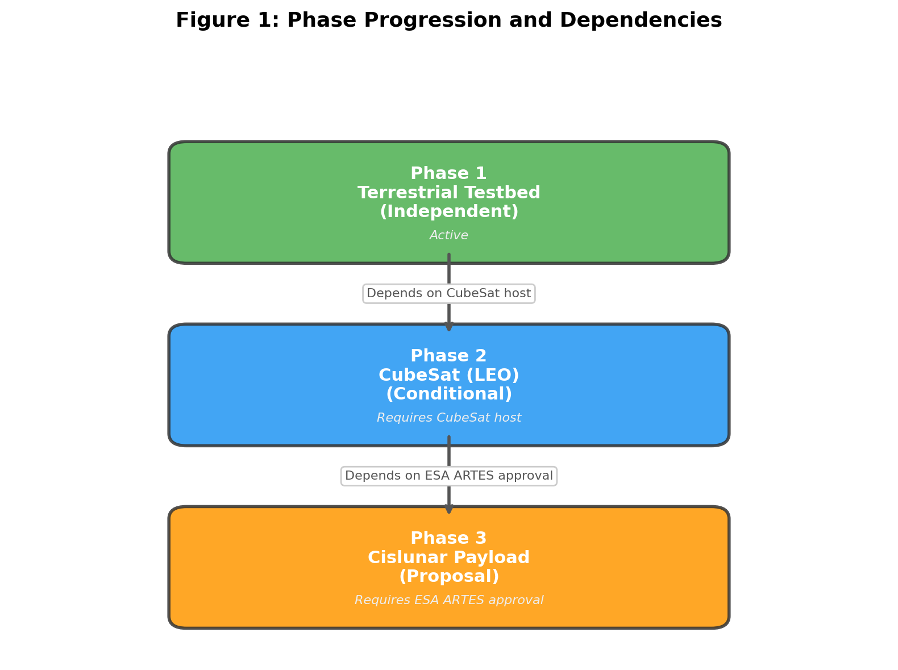
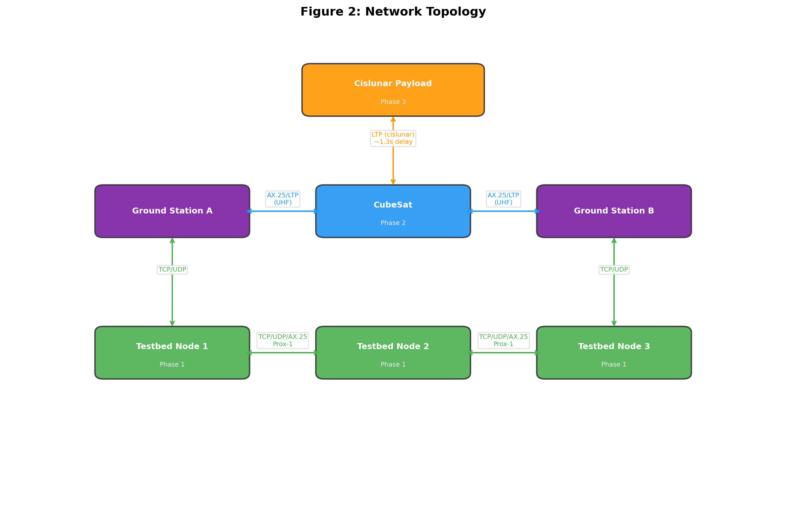
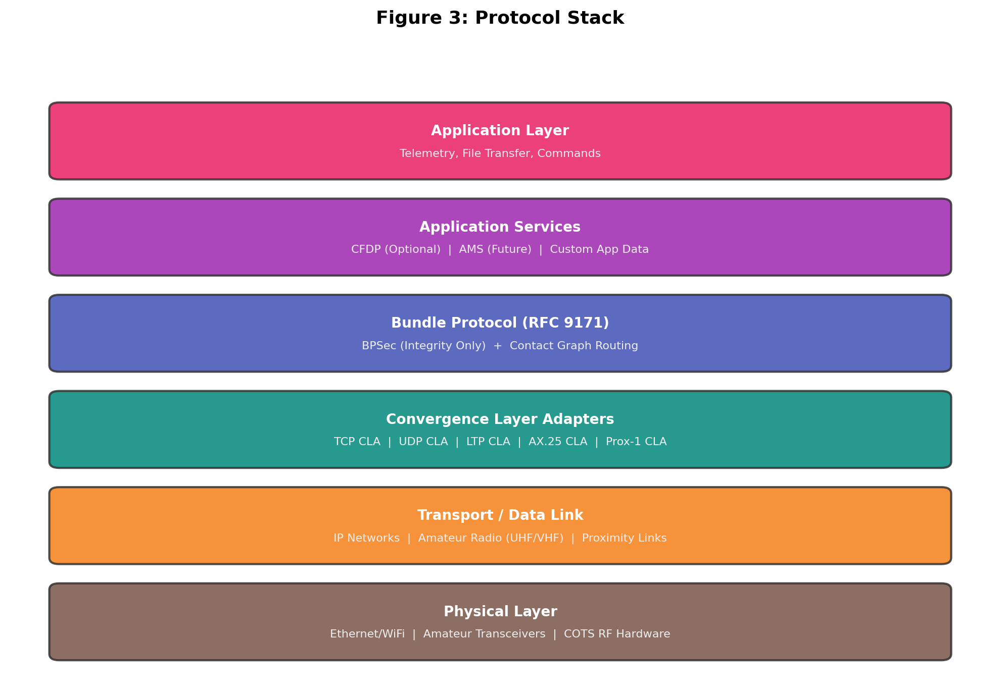

# Requirements Document: ION-DTN Cislunar Demonstration

| | |
|---|---|
| Document ID | ION-DTN-REQ-001 |
| Version | 0.1.0 |
| Status | Draft |
| Classification | Public |
| Licence | Apache License, Version 2.0 |

## Document Control

### Authorship

| Role | Name | Organisation |
|------|------|-------------|
| Lead Author | [name] | AMSAT-UK |
| Contributing Author | [name] | AMSAT-DL |
| Technical Review | [name] | [organisation] |

### Change History

| Version | Date | Author | Description |
|---------|------|--------|-------------|
| 0.1.0 | 2026-03-28 | [name] | Initial draft — 34 requirements across 3 phases, appendices A (candidate future requirements) and B (risk register) |

### Distribution

This document is released under the Apache License, Version 2.0 and may be freely distributed.

### Review and Approval

| Action | Name | Date | Signature |
|--------|------|------|-----------|
| Prepared by | [name] | | |
| Reviewed by | [name] | | |
| Approved by | [name] | | |

---

## Introduction

This document defines the requirements for a phased, open-source demonstration of ION-DTN (Interplanetary Overlay Network - Delay Tolerant Networking) capabilities, progressing from terrestrial networking through amateur CubeSat deployment to a cislunar payload demonstration. The project is led by AMSAT-UK and AMSAT-DL, and designed for the worldwide amateur radio, amateur satellite, and academic research communities, with initial development originating in the UK and Europe. It emphasises education, experimentation, reproducibility, and open collaboration. All phases target COTS (commercial off-the-shelf) hardware, open-source software, and amateur radio frequency allocations under applicable national and international amateur radio regulations (e.g., ITU Radio Regulations, IARU band plans, and relevant national licensing authorities) to maximise accessibility and community participation. The project validates DTN protocol performance across increasingly challenging communication environments, culminating in a space-based proof of concept for delay-tolerant networking beyond Earth orbit, with coordination through ESA and European academic institutions.

**Note on Phase 3 (Cislunar):** The cislunar payload phase is currently a proposal subject to ESA review and approval. If approved, Phase 3 would be funded under the ESA ARTES (Advanced Research in Telecommunications Systems) programme. All Phase 3 requirements in this document are therefore conditional on ESA approval and ARTES funding. Phases 1 (Terrestrial Testbed) and 2 (CubeSat) are not dependent on Phase 3 approval and will proceed independently.

**Note on Phase 2 (CubeSat):** Phase 2 is dependent upon identifying and partnering with a suitable CubeSat project host willing to accommodate the ION-DTN payload. All Phase 2 requirements are conditional on securing such a host. Phase 1 (Terrestrial Testbed) is not dependent on Phase 2 and will proceed independently.

## Phase 1 — Terrestrial Testbed Requirements

Phase 1 is the active, unconditional phase that delivers a ground-based ION-DTN network using COTS hardware and open-source software.

### Requirement 1: Terrestrial Testbed Deployment

**User Story:** As a user, I want to deploy a terrestrial ION-DTN testbed using COTS hardware and open-source software, starting with a simple point-to-point configuration and progressing to a multi-node network, so that I can validate Bundle Protocol operations incrementally before progressing to space-based phases.

#### Acceptance Criteria

1. THE Terrestrial_Testbed SHALL initially be deployed as a point-to-point configuration consisting of two ION_DTN Nodes to demonstrate basic Bundle_Protocol operation, bundle exchange, and store-and-forward behaviour.
2. AFTER successful point-to-point validation, THE Terrestrial_Testbed SHALL be expanded to a minimum of three ION_DTN Nodes to demonstrate multi-hop routing and Contact_Graph_Routing.
3. ALL Terrestrial_Testbed Nodes SHALL be built from COTS_Hardware (e.g., Raspberry Pi or equivalent single-board computers) running Open_Source_Software.
4. WHEN a Node in the Terrestrial_Testbed is started, THE Bundle_Agent on that Node SHALL initialize and register with the local ION_DTN configuration within 30 seconds.
5. THE Terrestrial_Testbed SHALL support TCP, UDP, and AX.25 Convergence_Layer_Adapters for inter-node communication.
6. WHEN a bundle is sent from a source Node to a destination Node, THE Terrestrial_Testbed SHALL deliver the bundle to the destination application within 10 seconds under nominal link conditions.
7. IF a Node in the Terrestrial_Testbed fails to start its Bundle_Agent, THEN THE Node SHALL log a descriptive error message indicating the failure reason.
8. THE Terrestrial_Testbed SHALL include setup documentation sufficient for an amateur radio operator or undergraduate student to reproduce both the point-to-point and multi-node configurations independently.

### Requirement 2: Terrestrial Link Disruption Simulation

**User Story:** As a user, I want to simulate link disruptions in the terrestrial testbed, so that I can verify store-and-forward behavior representative of real-world amateur satellite pass conditions before deploying to space.

#### Acceptance Criteria

1. THE Terrestrial_Testbed SHALL provide a mechanism to simulate Link_Disruption between any pair of Nodes for a configurable duration.
2. WHEN a Link_Disruption is active between two Nodes, THE Bundle_Agent on the sending Node SHALL store bundles destined for the disrupted link in persistent storage.
3. WHEN a simulated Link_Disruption ends, THE Bundle_Agent SHALL forward all stored bundles to the destination Node within 60 seconds of link restoration.
4. WHILE a Link_Disruption is active, THE Bundle_Agent SHALL continue to accept new bundles from local applications without data loss.
5. THE Terrestrial_Testbed SHALL log the start time, end time, and affected Node pair for each simulated Link_Disruption.

### Requirement 3: Contact Graph Routing Validation

**User Story:** As a user, I want to validate Contact Graph Routing in the terrestrial testbed, so that I can confirm correct multi-hop forwarding using predicted amateur satellite pass schedules before orbital deployment.

#### Acceptance Criteria

1. THE Terrestrial_Testbed SHALL support Contact_Graph_Routing with configurable contact plans defining scheduled link availability windows representative of amateur satellite orbital passes.
2. WHEN a contact plan is loaded, THE Bundle_Agent SHALL compute forwarding routes based on the time-varying contact graph within 5 seconds.
3. WHEN a bundle requires multi-hop delivery, THE Contact_Graph_Routing algorithm SHALL select the path with the earliest projected delivery time.
4. WHEN a scheduled contact window opens, THE Bundle_Agent SHALL begin forwarding queued bundles for that contact within 2 seconds.
5. IF no valid route exists for a bundle, THEN THE Bundle_Agent SHALL retain the bundle in storage and re-evaluate routing when the contact plan changes.

### Requirement 20: Delay and Disruption Emulation Profiles

**User Story:** As a user, I want pre-built link emulation profiles that simulate realistic LEO, HEO, and cislunar conditions in the terrestrial testbed, so that I can evaluate DTN performance under representative space link characteristics beyond simple on/off disruption.

#### Acceptance Criteria

1. THE Terrestrial_Testbed SHALL support configurable link emulation profiles that model variable latency, jitter, bandwidth constraints, and packet loss in addition to binary Link_Disruption.
2. THE project SHALL provide at least three pre-built emulation profiles: a LEO amateur satellite pass profile, a highly elliptical orbit (HEO) profile, and a cislunar link profile with realistic propagation delay and occlusion patterns.
3. WHEN a link emulation profile is active, THE Terrestrial_Testbed SHALL apply the configured delay, jitter, bandwidth, and loss parameters to all bundles traversing the emulated link.
4. THE link emulation profiles SHALL be defined in a documented, editable format so that users can create custom profiles for their own experimental scenarios.
5. THE link emulation software and profile definitions SHALL be released under the Apache License, Version 2.0.

---

## Phase 2 — CubeSat Requirements (Conditional on CubeSat Host)

Phase 2 is conditional on identifying and partnering with a suitable CubeSat project host willing to accommodate the ION-DTN payload.

### Requirement 4: CubeSat ION-DTN Integration (Conditional on CubeSat Host)

**User Story:** As a user, I want to integrate ION-DTN onto a CubeSat platform using COTS components, so that I can demonstrate delay-tolerant networking from low Earth orbit on an IARU-coordinated amateur radio frequency allocation.

#### Acceptance Criteria

1. THE CubeSat SHALL run a Bundle_Agent capable of sending, receiving, and forwarding bundles via the Bundle_Protocol using Open_Source_Software.
2. THE CubeSat Bundle_Agent SHALL operate within a memory footprint of 256 MB or less, compatible with COTS_Hardware flight computers available to amateur satellite programmes.
3. THE CubeSat SHALL support Licklider_Transmission_Protocol and AX.25 as Convergence_Layer_Adapters for ground-to-space links on Amateur_Radio_Band allocations (e.g., UHF 70 cm band per IARU band plan).
4. WHEN the CubeSat has line-of-sight to a Ground_Station, THE CubeSat SHALL establish a link session and begin bundle exchange within 10 seconds of link acquisition.
5. THE CubeSat SHALL store bundles in non-volatile storage with a capacity of at least 1 GB for Store_And_Forward operations.
6. IF the CubeSat loses power during a bundle transfer, THEN THE Bundle_Agent SHALL recover and resume pending transfers from the last checkpoint after power restoration.
7. THE CubeSat flight software and configuration SHALL be published under the Apache License, Version 2.0 to enable community replication and experimentation.

### Requirement 5: Ground Station Communication (Conditional on CubeSat Host)

**User Story:** As a user, I want to communicate with the CubeSat from my amateur ground station, so that I can exchange DTN bundles during orbital passes using standard amateur radio equipment.

#### Acceptance Criteria

1. THE Ground_Station SHALL run a Bundle_Agent configured to communicate with the CubeSat via Licklider_Transmission_Protocol or AX.25 on Amateur_Radio_Band frequencies.
2. WHEN a CubeSat orbital pass begins, THE Ground_Station SHALL detect link availability and initiate bundle exchange within 15 seconds.
3. WHILE the CubeSat is within communication range, THE Ground_Station SHALL sustain a minimum data throughput of 9.6 kbps for bundle transfers, achievable with commonly available amateur radio transceivers.
4. WHEN an orbital pass ends, THE Ground_Station SHALL complete or checkpoint all in-progress bundle transfers within 5 seconds of link loss detection.
5. THE Ground_Station SHALL maintain a transfer log recording bundle identifiers, timestamps, transfer status, and byte counts for each pass.
6. THE Ground_Station setup SHALL be documented with a bill of materials and configuration guide reproducible by amateur radio operators holding a valid amateur radio licence from their national administration.

### Requirement 6: CubeSat Custody Transfer (Conditional on CubeSat Host)

**User Story:** As a user, I want custody transfer support on the CubeSat, so that I can ensure bundles are not lost during intermittent amateur satellite orbital contacts.

#### Acceptance Criteria

1. THE CubeSat Bundle_Agent SHALL support Custody_Transfer for bundles marked with custody-requested delivery options.
2. WHEN the CubeSat accepts custody of a bundle, THE Bundle_Agent SHALL send a custody acceptance signal to the previous custodian.
3. WHILE the CubeSat holds custody of a bundle, THE Bundle_Agent SHALL retain the bundle in non-volatile storage until custody is transferred to the next hop or the bundle is delivered.
4. IF a custody acceptance signal is not received within 120 seconds, THEN THE sending Bundle_Agent SHALL retransmit the bundle.
5. THE Bundle_Agent SHALL log all custody transfer events including bundle identifier, timestamp, and transfer outcome.

---

## Phase 3 — Cislunar Payload Requirements (Conditional on ESA ARTES)

Phase 3 is a proposal subject to ESA ARTES programme review and approval.

### Requirement 7: Cislunar Payload Hardware Integration (Conditional on ESA ARTES Approval)

**User Story:** As a user, I want to integrate ION-DTN onto a cislunar-capable payload using COTS components, so that I can demonstrate delay-tolerant networking at lunar distances as an educational and community research mission.

#### Acceptance Criteria

1. THE Cislunar_Payload SHALL run a Bundle_Agent supporting Bundle_Protocol and Licklider_Transmission_Protocol using Open_Source_Software.
2. THE Cislunar_Payload SHALL operate within a power budget of 10 watts average during DTN operations, consistent with secondary payload or rideshare power allocations on ESA or European commercial launch opportunities.
3. THE Cislunar_Payload SHALL provide at least 4 GB of non-volatile storage for bundle buffering using COTS_Hardware storage components.
4. THE Cislunar_Payload SHALL tolerate a radiation environment consistent with cislunar transit and lunar orbit, using radiation-tolerant COTS_Hardware or software-based error mitigation.
5. IF the Cislunar_Payload detects a single-event upset in memory, THEN THE Cislunar_Payload SHALL initiate error correction and log the event.
6. THE Cislunar_Payload hardware design and software SHALL be published under the Apache License, Version 2.0 with sufficient documentation for academic replication by university research groups worldwide.

### Requirement 8: Cislunar Delay-Tolerant Communication (Conditional on ESA ARTES Approval)

**User Story:** As a user, I want to demonstrate DTN communication at cislunar distances, so that I can validate protocol performance with round-trip delays of approximately 2.5 seconds and contribute experimental data to the amateur and academic communities.

#### Acceptance Criteria

1. THE Cislunar_Payload SHALL exchange bundles with a Ground_Station over links with a one-way light delay of up to 1.5 seconds, operating on amateur radio frequency allocations coordinated through IARU and the relevant national administration.
2. WHEN a bundle is sent from the Ground_Station to the Cislunar_Payload, THE Licklider_Transmission_Protocol SHALL manage retransmission timers calibrated to the current Round_Trip_Time.
3. THE Cislunar_Payload SHALL sustain a minimum bundle throughput of 1 kbps over the cislunar link under nominal conditions.
4. WHILE the Cislunar_Payload is in lunar orbit, THE Contact_Graph_Routing algorithm SHALL account for periodic link occlusion by the Moon.
5. WHEN a cislunar link is disrupted due to lunar occlusion, THE Bundle_Agent SHALL store bundles and resume forwarding within 30 seconds of link reacquisition.

---

## Project Overview

### Figure 1: Phase Progression and Dependencies

### Table 1: Phase Summary

| Phase | Scope | Dependencies | Status | Key Deliverables |
|-------|-------|-------------|--------|-----------------|
| 1 — Terrestrial Testbed | Ground-based ION-DTN network using COTS hardware | None | Active | Testbed software, link emulation, CGR validation, mission ops suite |
| 2 — CubeSat (LEO) | ION-DTN payload on amateur CubeSat in low Earth orbit | Suitable CubeSat project host | Conditional | Flight software, ground station integration, custody transfer |
| 3 — Cislunar Payload | ION-DTN demonstration at lunar distances | ESA ARTES approval and funding | Proposal | Cislunar hardware, delay-tolerant comms, end-to-end interop |

### Figure 2: Network Topology

### Figure 3: Protocol Stack

### Table 2: Requirements Traceability Matrix

| Req | Title | Phase | Status | Category |
|-----|-------|-------|--------|----------|
| 1 | Terrestrial Testbed Deployment | 1 | Mandatory | Infrastructure |
| 2 | Terrestrial Link Disruption Simulation | 1 | Mandatory | Testing |
| 3 | Contact Graph Routing Validation | 1 | Mandatory | Protocol |
| 4 | CubeSat ION-DTN Integration | 2 | Conditional (CubeSat host) | Integration |
| 5 | Ground Station Communication | 2 | Conditional (CubeSat host) | Communication |
| 6 | CubeSat Custody Transfer | 2 | Conditional (CubeSat host) | Protocol |
| 7 | Cislunar Payload Hardware Integration | 3 | Conditional (ESA ARTES) | Integration |
| 8 | Cislunar Delay-Tolerant Communication | 3 | Conditional (ESA ARTES) | Communication |
| 9 | End-to-End Multi-Phase Interoperability | 1-3 | Mandatory | Interoperability |
| 10 | Configuration Serialization and Parsing | 1-3 | Mandatory | Tooling |
| 11 | Monitoring and Telemetry | 1-3 | Mandatory | Operations |
| 12 | Security and Authentication | 1-3 | Mandatory | Security |
| 13 | Open Access and Community Collaboration | 1-3 | Mandatory | Governance |
| 14 | Network Control / Mission Ops Suite | 1-3 | Mandatory | Operations |
| 15 | Public Downlink Telemetry Protocols/APIs | 1-3 | Mandatory | Interfaces |
| 16 | No Service Level Agreement | 1-3 | Mandatory | Governance |
| 17 | Worldwide Adoption and International Participation | 1-3 | Mandatory | Governance |
| 18 | Multi-Ground-Station Federation | 1-3 | Mandatory | Infrastructure |
| 19 | DTN Gateway Bridging | 1-3 | Mandatory | Interoperability |
| 20 | Delay and Disruption Emulation Profiles | 1 | Mandatory | Testing |
| 21 | STEAM Educational Enablement | 1-3 | Mandatory | Outreach |
| 22 | Public Dashboard and Live Visualisation | 1-3 | Mandatory | Outreach |
| 23 | Data Archive and Experiment Replay | 1-3 | Mandatory | Data |
| 24 | Test-Driven Development | 1-3 | Mandatory | Process |
| 25 | Continuous Integration | 1-3 | Mandatory | Process |
| 26 | Continuous Deployment | 1-3 | Mandatory | Process |
| 27 | ION-DTN Baseline Test Suite Compliance | 1-3 | Mandatory | Process |
| 28 | CCSDS CFDP Demonstration | 1-3 | Optional | Protocol |
| 29 | CCSDS Space Packet Protocol Framing | 2-3 | Optional | Protocol |
| 30 | CCSDS Proximity-1 Demonstration | 1 | Optional | Protocol |
| 31 | APRS-Style SSID Role Conventions | 1-3 | Optional | Convention |
| 32 | DTN Node Beacon Bundles | 1-3 | Optional | Protocol |
| 33 | APRS-Compatible Message Format for Gateway | 1-3 | Optional | Interoperability |
| 34 | Bundle Fragmentation for Constrained Links | 1-3 | Mandatory | Protocol |

### Table 3: Protocol and Interface Usage by Phase

| Protocol / Interface | Phase 1 (Terrestrial) | Phase 2 (CubeSat) | Phase 3 (Cislunar) |
|---------------------|----------------------|-------------------|-------------------|
| Bundle Protocol (BP) | Yes | Yes | Yes |
| BPSec (Integrity) | Yes | Yes | Yes |
| Contact Graph Routing | Yes | Yes | Yes |
| TCP CLA | Yes | — | — |
| UDP CLA | Yes | — | — |
| AX.25 CLA | Yes | Yes (UHF uplink/downlink) | — |
| LTP CLA | — | Yes (ground-to-space) | Yes (cislunar link) |
| Proximity-1 CLA | Optional | — | — |
| CFDP | Optional | Optional | Optional |
| CCSDS Space Packet | — | Optional | Optional |
| Custody Transfer | Yes (testing) | Yes | Yes |

### Table 4: Frequency Allocations and Modulation Schemes

| Band | Frequency Range | IARU Region 1 Allocation | Typical Use in Project | Modulation | Data Rate |
|------|----------------|-------------------------|----------------------|------------|-----------|
| VHF 2 m | 144–146 MHz | Primary amateur allocation | Terrestrial testbed AX.25 links | FM/AFSK | 1200 baud |
| UHF 70 cm | 430–440 MHz | Primary amateur allocation | CubeSat uplink/downlink, ground station links | BPSK | 9600 bps |
| L-band 23 cm | 1240–1300 MHz | Secondary amateur allocation | Potential cislunar link (subject to coordination) | BPSK | TBD |
| S-band 13 cm | 2300–2450 MHz | Secondary amateur allocation | Potential cislunar link (subject to coordination) | BPSK | TBD |

## Glossary

- **ION_DTN**: The Interplanetary Overlay Network implementation of the Delay Tolerant Networking architecture, providing store-and-forward message delivery over disrupted and delayed communication links. ION_DTN is open-source software available to the amateur and academic communities.
- **Bundle_Protocol**: The core DTN protocol (RFC 9171) that encapsulates application data into bundles for store-and-forward relay across intermittent links.
- **Convergence_Layer_Adapter (CLA)**: The protocol adapter that maps Bundle Protocol operations onto underlying transport protocols (e.g., TCP, UDP, LTP, AX.25).
- **Licklider_Transmission_Protocol (LTP)**: A point-to-point reliable transport protocol designed for long-delay links, used as a convergence layer for DTN.
- **Bundle_Agent**: A software component that implements the Bundle Protocol, responsible for sending, receiving, forwarding, and storing bundles.
- **Contact_Graph_Routing (CGR)**: A routing algorithm that computes optimal forwarding paths using a time-varying contact graph of scheduled link opportunities.
- **CubeSat**: A class of small satellite built to standard dimensions (units of 10×10×10 cm), used as the orbital platform in Phase 2. In this project, the CubeSat is built using COTS components within amateur satellite programme budgets, with frequency coordination through IARU and launch opportunities via ESA or European commercial providers. Phase 2 is dependent on identifying a suitable CubeSat project host for the ION-DTN payload.
- **Cislunar_Payload**: The demonstration hardware and software package deployed in cislunar space (between Earth and the Moon) for Phase 3, designed as a rideshare or secondary payload opportunity on ESA or European commercial missions. Phase 3 is a proposal subject to ESA ARTES programme approval and funding.
- **Ground_Station**: An amateur radio ground station equipped with communication hardware and ION_DTN software for exchanging bundles with orbital or cislunar assets, operating under licensed amateur radio frequency allocations and IARU band plans.
- **Terrestrial_Testbed**: The ground-based network of ION_DTN nodes used in Phase 1 to validate DTN operations before space deployment, built from COTS hardware (e.g., Raspberry Pi, commodity PCs) and open-source software.
- **Node**: A network endpoint running a Bundle_Agent capable of sending, receiving, and forwarding bundles.
- **Custody_Transfer**: A DTN reliability mechanism where a forwarding node accepts responsibility for onward delivery of a bundle.
- **Store_And_Forward**: The DTN operating mode where bundles are persistently stored at intermediate nodes until a forwarding opportunity becomes available. Store-and-forward is a well-established paradigm in the amateur satellite community, used extensively in amateur packet radio BBS systems and digital store-and-forward satellites since the 1980s.
- **Link_Disruption**: A period during which communication between two nodes is unavailable due to orbital geometry, interference, or hardware constraints.
- **Round_Trip_Time (RTT)**: The elapsed time for a signal to travel from a sender to a receiver and back; cislunar RTT ranges from approximately 2.5 to 2.7 seconds.
- **Amateur_Radio_Band**: Radio frequency allocations designated for amateur radio use (e.g., UHF 70 cm, VHF 2 m, microwave bands) under applicable national amateur radio regulations, CEPT recommendations (where applicable), and IARU band plans.
- **Ofcom**: The UK Office of Communications, the regulatory authority responsible for amateur radio licensing and spectrum management in the United Kingdom. Referenced as an example of a national licensing authority.
- **CEPT**: The European Conference of Postal and Telecommunications Administrations, which harmonises amateur radio frequency allocations across European administrations.
- **IARU_Region_1**: The International Amateur Radio Union Region 1, covering Europe, Africa, the Middle East, and Northern Asia, which coordinates amateur radio band plans and operating practices.
- **ESA**: The European Space Agency, the intergovernmental organisation coordinating European space research and technology development.
- **ARTES**: Advanced Research in Telecommunications Systems, an ESA programme funding research and development in satellite communications. Phase 3 of this project is proposed for funding under ARTES, subject to ESA review and approval.
- **Amateur_Radio_Licence**: An amateur radio licence issued by a national administration (e.g., Ofcom in the UK, BNetzA in Germany, FCC in the US), granting operating privileges on amateur radio frequency allocations. Licence tiers and privileges vary by country.
- **COTS_Hardware**: Commercial off-the-shelf hardware components readily available and affordable for amateur and academic use (e.g., Raspberry Pi, SDR dongles, amateur radio transceivers).
- **AX.25**: An amateur radio data link layer protocol (version 2.2) commonly used for packet radio communication, suitable as a convergence layer transport for DTN in amateur contexts.
- **AFSK**: Audio Frequency Shift Keying, a modulation scheme used with FM radio to transmit digital data at 1200 baud. Standard modulation for terrestrial AX.25 packet radio links in this project.
- **BPSK**: Binary Phase Shift Keying, a modulation scheme encoding one bit per symbol. Used for CubeSat uplink/downlink at 9600 bps, offering robust performance at amateur power levels with good Doppler tolerance.
- **Open_Source_Software**: Software released under the Apache License, Version 2.0, enabling community review, modification, and redistribution.

## Cross-Cutting Requirements

### Requirement 9: End-to-End Multi-Phase Interoperability

**User Story:** As a user, I want end-to-end interoperability across all three phases, so that I can demonstrate a seamless DTN path from terrestrial nodes through the CubeSat relay to the cislunar payload and share results with the amateur and academic communities.

#### Acceptance Criteria

1. THE ION_DTN network SHALL support end-to-end bundle delivery from any Terrestrial_Testbed Node to the Cislunar_Payload via the CubeSat as an intermediate relay.
2. WHEN a bundle traverses multiple hops across terrestrial, orbital, and cislunar segments, THE Bundle_Protocol SHALL maintain bundle integrity verified by bundle integrity blocks.
3. THE Contact_Graph_Routing algorithm SHALL compute routes spanning terrestrial, CubeSat, and cislunar contact schedules in a unified contact plan.
4. WHEN an end-to-end bundle delivery is completed, THE destination Bundle_Agent SHALL generate a delivery confirmation report sent back to the source Node.
5. THE ION_DTN network SHALL deliver end-to-end bundles from a Terrestrial_Testbed Node to the Cislunar_Payload within the sum of individual segment delays plus a 120-second processing margin.

### Requirement 10: Configuration Serialization and Parsing

**User Story:** As a user, I want to define and parse ION-DTN node configurations from structured files, so that I can consistently deploy and replicate node setups across all phases and share configurations with collaborating institutions.

#### Acceptance Criteria

1. THE ION_DTN configuration system SHALL parse Node configuration files conforming to a defined configuration grammar.
2. WHEN a valid configuration file is provided, THE configuration parser SHALL produce a structured Configuration object representing all node parameters.
3. IF an invalid configuration file is provided, THEN THE configuration parser SHALL return a descriptive error indicating the line number and nature of the violation.
4. THE configuration printer SHALL format Configuration objects back into valid configuration files conforming to the defined grammar.
5. FOR ALL valid Configuration objects, parsing a configuration file then printing then parsing the result SHALL produce an equivalent Configuration object (round-trip property).

### Requirement 11: Monitoring and Telemetry

**User Story:** As a user, I want monitoring and telemetry from all DTN nodes, so that I can assess network health, diagnose issues, and contribute operational data to the community across all phases.

#### Acceptance Criteria

1. THE Bundle_Agent on each Node SHALL report bundle delivery statistics including bundles sent, received, forwarded, and expired at a configurable interval.
2. WHEN a bundle delivery fails, THE Bundle_Agent SHALL generate a status report containing the bundle identifier, failure reason, and timestamp.
3. THE Ground_Station SHALL aggregate telemetry from all reachable Nodes and present a consolidated network status view.
4. WHILE the CubeSat or Cislunar_Payload is in contact with a Ground_Station, THE Node SHALL transmit queued telemetry bundles with priority over regular data bundles.
5. THE monitoring system SHALL retain telemetry records for a minimum of 30 days.
6. THE monitoring system SHALL publish telemetry data in an open format accessible to community participants for independent analysis.

### Requirement 12: Security and Authentication

**User Story:** As a user, I want authentication and integrity protection for DTN bundles, so that I can prevent unauthorized access and data tampering while complying with amateur radio regulations requiring open and non-encrypted transmissions.

#### Acceptance Criteria

1. THE Bundle_Agent SHALL support Bundle Protocol Security (BPSec) for bundle authentication and integrity verification.
2. WHEN a bundle is created, THE source Bundle_Agent SHALL attach a Block Integrity Block (BIB) using a configured cryptographic key for integrity verification.
3. WHEN a bundle is received, THE destination Bundle_Agent SHALL verify the Block Integrity Block and reject bundles that fail verification.
4. IF a bundle fails integrity verification, THEN THE Bundle_Agent SHALL log the bundle identifier, source, and failure reason, and discard the bundle.
5. THE ION_DTN network SHALL use pre-shared symmetric keys distributed to all authorized Nodes prior to mission operations.
6. THE security implementation SHALL comply with applicable amateur radio regulations regarding restrictions on message encryption, using integrity verification without payload encryption for over-the-air amateur radio links.

### Requirement 13: Open Access and Community Collaboration

**User Story:** As a user, I want all project artifacts to be openly accessible, so that I can learn from, reproduce, and contribute to the ION-DTN cislunar demonstration.

#### Acceptance Criteria

1. THE project SHALL publish all software source code under the Apache License, Version 2.0.
2. THE project SHALL publish hardware designs, schematics, and bills of materials under the Apache License, Version 2.0 or a compatible open hardware licence.
3. THE project SHALL publish experiment results, telemetry datasets, and analysis reports in open-access formats within 90 days of data collection.
4. THE project SHALL maintain a public repository for source code, documentation, and issue tracking accessible to community contributors.
5. THE project SHALL provide a contributor guide documenting how amateur radio operators, students, and researchers can participate in testbed operations, ground station networking, and data analysis.

### Requirement 14: Network Control and Mission Operations Software Suite

**User Story:** As a user, I want a unified network control and mission operations software suite available across all project phases, so that I can manage DTN node configurations, monitor network status, schedule contacts, and coordinate mission activities from a single interface.

#### Acceptance Criteria

1. THE project SHALL provide a Mission_Operations_Suite capable of managing ION_DTN network operations across all three phases (Terrestrial_Testbed, CubeSat, and Cislunar_Payload).
2. THE Mission_Operations_Suite SHALL provide a graphical or web-based interface for viewing real-time Node status, link connectivity, and bundle delivery metrics.
3. THE Mission_Operations_Suite SHALL support remote configuration of Bundle_Agent parameters on reachable Nodes, including contact plan updates and routing table modifications.
4. THE Mission_Operations_Suite SHALL integrate with Contact_Graph_Routing to display scheduled contact windows and allow operators to upload revised contact plans.
5. THE Mission_Operations_Suite SHALL provide pass prediction and scheduling tools for CubeSat and Cislunar_Payload communication windows, using standard orbital element formats (e.g., TLE/OMM).
6. THE Mission_Operations_Suite SHALL log all operator commands, configuration changes, and significant network events with timestamps for audit and post-mission analysis.
7. THE Mission_Operations_Suite SHALL be deployable on COTS_Hardware and released under the Apache License, Version 2.0.
8. THE Mission_Operations_Suite SHALL support multi-operator access with role-based permissions to coordinate distributed ground station operations across participating amateur radio stations and university facilities.

### Requirement 15: Public Downlink Telemetry Protocols and APIs

**User Story:** As a user, I want all downlink telemetry protocol schemas and APIs to be publicly documented, so that I can build my own ground station decoders, analysis tools, and integrations with the ION-DTN network.

#### Acceptance Criteria

1. THE project SHALL publish all downlink telemetry protocol schemas, including frame formats, field definitions, encoding rules, and byte-level specifications, in a publicly accessible repository.
2. THE project SHALL provide a documented API for accessing decoded telemetry data from Ground_Station systems, published under the Apache License, Version 2.0.
3. THE telemetry protocol documentation SHALL be sufficient for an independent amateur radio operator to implement a compatible decoder without access to project source code.
4. WHEN telemetry protocol schemas or APIs are updated, THE project SHALL publish the revised documentation within 30 days of the change taking effect.
5. THE project SHALL provide reference decoder implementations for all downlink telemetry formats, released under the Apache License, Version 2.0.

### Requirement 16: No Service Level Agreement

**User Story:** As a user, I want it clearly stated that the ION-DTN demonstration network is provided on a best-effort basis without any service level agreement, so that participants and users understand there are no guarantees of availability, uptime, or performance.

#### Acceptance Criteria

1. THE project SHALL NOT provide any service level agreement (SLA) for network availability, uptime, throughput, or bundle delivery guarantees.
2. THE project documentation SHALL include a prominent disclaimer stating that all DTN services across all phases are provided on a best-effort, experimental basis with no warranty of service continuity.
3. THE project SHALL NOT accept liability for data loss, delivery failure, or service interruption arising from the use of the ION_DTN demonstration network.
4. ALL public-facing documentation, APIs, and telemetry interfaces SHALL include a notice that the service is experimental and not intended for operational or safety-critical use.

### Requirement 17: Worldwide Adoption and International Participation

**User Story:** As a user, I want the project to actively support worldwide participation, so that I can contribute ground station coverage, collaborate on research, and adopt the ION-DTN platform regardless of my geographic location.

#### Acceptance Criteria

1. THE project SHALL design all software, protocols, and documentation to be region-agnostic, avoiding hard dependencies on UK or EU-specific infrastructure, services, or regulatory assumptions.
2. THE project documentation SHALL reference IARU international band plans and ITU Radio Regulations, so that operators in all three IARU regions can identify applicable frequency allocations.
3. THE Ground_Station software and configuration guides SHALL support amateur radio licence frameworks from any national administration.
4. THE project SHALL provide documentation and configuration templates in English as the primary language, with a structure that facilitates community-contributed translations.
5. THE Mission_Operations_Suite SHALL support registration and coordination of ground stations located anywhere in the world, enabling a globally distributed ground station network.
6. THE project SHALL welcome and document processes for international contributors to participate in development, testing, ground station operations, and data analysis through the public repository and contributor guide.

### Requirement 18: Multi-Ground-Station Federation

**User Story:** As a user, I want to federate my station with other participating ground stations worldwide, so that we can pool pass coverage and maximise aggregate contact time with the CubeSat and cislunar payload.

#### Acceptance Criteria

1. THE project SHALL define a federation protocol enabling independent Ground_Stations to register, discover, and coordinate with each other for cooperative pass coverage.
2. THE Mission_Operations_Suite SHALL display a consolidated view of all federated Ground_Stations, including their geographic location, capabilities, and scheduled pass assignments.
3. WHEN multiple federated Ground_Stations have overlapping visibility of the CubeSat or Cislunar_Payload, THE Mission_Operations_Suite SHALL coordinate pass assignments to avoid redundant transmissions and maximise data throughput.
4. THE federation protocol SHALL support Ground_Stations operated by different organisations or individuals without requiring centralised administrative control.
5. THE federation protocol and registration API SHALL be published under the Apache License, Version 2.0.

### Requirement 19: DTN Gateway Bridging to Amateur Packet Networks

**User Story:** As a user, I want the ION-DTN network to bridge with established amateur packet networks such as APRS and Winlink, so that I can exchange data between DTN and legacy amateur systems.

#### Acceptance Criteria

1. THE project SHALL provide a DTN gateway component capable of translating between ION_DTN Bundle_Protocol and at least one established amateur packet network protocol (e.g., APRS, Winlink, or packet BBS).
2. WHEN a bundle is received by the DTN gateway from the ION_DTN network destined for an amateur packet network, THE gateway SHALL encapsulate or translate the bundle payload into the target protocol format and forward it.
3. WHEN a message is received by the DTN gateway from an amateur packet network destined for the ION_DTN network, THE gateway SHALL encapsulate the message as a bundle and inject it into the DTN network.
4. THE DTN gateway SHALL log all bridged messages including source protocol, destination protocol, timestamp, and delivery status.
5. THE DTN gateway software SHALL be released under the Apache License, Version 2.0 with documentation sufficient for an amateur radio operator to deploy independently.

### Requirement 21: STEAM Educational Enablement

**User Story:** As a user, I want the project to provide the tools, APIs, data access, and documentation necessary to build STEAM (Science, Technology, Engineering, Arts, and Mathematics) educational materials, so that I can create my own teaching resources around the ION-DTN project.

#### Acceptance Criteria

1. THE project SHALL provide publicly accessible APIs, data feeds, and documentation sufficient for educators to build their own lab exercises, tutorials, and course materials around each of the three project phases (terrestrial, CubeSat, cislunar).
2. THE project SHALL document example use cases spanning STEAM disciplines including: networking and computer science (Technology/Engineering), orbital mechanics and radio propagation (Science/Mathematics), and data visualisation and mission branding/identity design (Arts).
3. THE project SHALL ensure that all testbed software, telemetry APIs, dashboard components, and data archive tools are usable on COTS_Hardware by educators and students without requiring specialist equipment or paid licences.
4. THE project SHALL publish all enablement documentation under the Apache License, Version 2.0 or a Creative Commons Attribution 4.0 (CC BY 4.0) licence to permit adaptation and redistribution by educators worldwide.
5. THE project SHALL NOT be responsible for producing curriculum packages, lesson plans, or assessment materials; the project provides the platform and data for others to build upon.

### Requirement 22: Public Dashboard and Live Network Visualisation

**User Story:** As a user, I want a web-based real-time dashboard showing satellite position, active ground stations, recent bundle deliveries, and network health, so that I can follow the mission progress and engage with the project.

#### Acceptance Criteria

1. THE project SHALL provide a publicly accessible web-based dashboard displaying real-time or near-real-time ION_DTN network status.
2. THE dashboard SHALL display current and predicted satellite positions for the CubeSat and Cislunar_Payload on an interactive map, using publicly available orbital elements.
3. THE dashboard SHALL display the locations and online status of federated Ground_Stations participating in the network.
4. THE dashboard SHALL display recent bundle delivery events, including source, destination, hop count, and delivery latency.
5. THE dashboard SHALL present network health metrics including aggregate throughput, bundle success rate, and active link count.
6. THE dashboard source code SHALL be released under the Apache License, Version 2.0.
7. THE dashboard SHALL be designed with accessibility in mind, following WCAG 2.1 Level AA guidelines where practicable, to support the widest possible audience.

### Requirement 23: Data Archive and Experiment Replay

**User Story:** As a user, I want a publicly accessible archive of all experiment data with replay capability, so that I can re-analyse historical passes, bundle flows, and network behaviour for research publications and educational use.

#### Acceptance Criteria

1. THE project SHALL maintain a publicly accessible data archive containing telemetry records, bundle delivery logs, contact event logs, and link performance measurements from all project phases.
2. THE data archive SHALL store records in documented, open formats (e.g., CSV, JSON, or Parquet) with accompanying schema definitions.
3. THE data archive SHALL support query and download of records filtered by time range, Node identifier, phase, and event type.
4. THE project SHALL provide a replay tool capable of replaying archived data through the Mission_Operations_Suite or dashboard to reconstruct historical network states.
5. THE data archive and replay tool SHALL be released under the Apache License, Version 2.0.
6. THE data archive SHALL retain records for a minimum of five years following the conclusion of each project phase.

### Requirement 24: Test-Driven Development

**User Story:** As a user, I want all software components to be developed using test-driven development (TDD) practices, so that I can have confidence in code correctness and catch regressions early.

#### Acceptance Criteria

1. THE project SHALL adopt a test-driven development methodology where tests are written before or alongside the implementation code for all software components.
2. ALL software modules SHALL maintain a minimum of 80% code coverage as measured by automated test tooling.
3. THE project SHALL employ property-based testing for protocol-level components including Bundle_Protocol handling, Contact_Graph_Routing, configuration parsing, and Convergence_Layer_Adapter behaviour.
4. THE project SHALL maintain unit tests, integration tests, and end-to-end tests as distinct test suites, each executable independently.
5. ALL tests SHALL be executable on COTS_Hardware without requiring access to space segment hardware or live radio links.

### Requirement 25: Continuous Integration

**User Story:** As a user, I want an automated continuous integration (CI) pipeline that builds and tests every code change, so that I can ensure the codebase remains stable and regressions are detected before merging.

#### Acceptance Criteria

1. THE project SHALL operate a continuous integration pipeline that automatically builds all software components and executes the full test suite on every commit or pull/merge request to the main repository.
2. THE CI pipeline SHALL report build and test results within 30 minutes of a commit being pushed.
3. THE CI pipeline SHALL block merging of code changes that fail any build step, unit test, integration test, or property-based test.
4. THE CI pipeline SHALL run static analysis and linting checks as part of every build.
5. THE CI pipeline configuration SHALL be defined in version-controlled files within the project repository and released under the Apache License, Version 2.0.
6. THE CI pipeline SHALL be executable using publicly available, free-tier CI services (e.g., GitHub Actions, GitLab CI) to avoid cost barriers for community contributors.

### Requirement 26: Continuous Deployment

**User Story:** As a user, I want an automated continuous deployment (CD) pipeline that delivers validated software releases to testbed nodes and ground station systems, so that I can keep the network running the latest stable software with minimal manual intervention.

#### Acceptance Criteria

1. THE project SHALL operate a continuous deployment pipeline that automatically packages and publishes release artefacts upon successful completion of the CI pipeline on the main branch.
2. THE CD pipeline SHALL produce versioned, reproducible build artefacts (e.g., container images, binary packages, or installation scripts) for all deployable software components.
3. THE CD pipeline SHALL support automated deployment to Terrestrial_Testbed Nodes and Ground_Station systems that opt in to automatic updates.
4. THE CD pipeline SHALL support staged rollouts, allowing deployment to a subset of nodes before full network-wide release.
5. THE CD pipeline SHALL generate release notes summarising changes, test results, and known issues for each published version.
6. THE CD pipeline SHALL NOT automatically deploy to CubeSat or Cislunar_Payload flight systems; flight software updates SHALL require explicit manual approval and a separate upload procedure.

### Requirement 27: ION-DTN Baseline Test Suite Compliance

**User Story:** As a user, I want the project's ION-DTN build to pass the existing ION-DTN test suite as a minimum baseline, so that I can be confident the wrapped ION implementation is functionally correct before any project-specific extensions or tests are applied.

#### Acceptance Criteria

1. THE project SHALL build ION-DTN from source and execute the existing ION-DTN test suite (located in `tests/` within the ION source tree) as part of every CI pipeline run.
2. ALL tests in the ION-DTN `alltests` test set SHALL pass on the project's target platforms (Linux x86_64 and ARM/Raspberry Pi) before any project release.
3. IF an ION-DTN baseline test fails, THE CI pipeline SHALL block the build and report the failing test name and output.
4. THE project SHALL not modify or disable any existing ION-DTN tests without documenting the reason and obtaining maintainer approval.
5. THE project's own test suites (unit, property-based, integration, end-to-end) SHALL be additive to the ION-DTN baseline tests, not a replacement.

### Requirement 34: Bundle Fragmentation for Constrained Links

**User Story:** As a user, I want ION-DTN to fragment large bundles for transmission over bandwidth-constrained links (e.g., 1200 baud AFSK or 9600 bps BPSK), so that bundles larger than the link MTU can be delivered without manual splitting.

#### Acceptance Criteria

1. THE Bundle_Agent SHALL support proactive fragmentation of bundles that exceed a configurable maximum fragment size per outbound link.
2. WHEN a bundle is fragmented, THE destination Bundle_Agent SHALL reassemble all fragments into the original bundle and verify integrity via the Block Integrity Block.
3. THE fragmentation configuration SHALL be settable per CLA binding in the TOML node configuration, allowing different fragment sizes for different link types (e.g., smaller fragments for AFSK, larger for BPSK 9K6).
4. IF one or more fragments are lost during transmission, THE Licklider_Transmission_Protocol or Custody_Transfer mechanism SHALL handle retransmission of the missing fragments.
5. THE project SHALL test bundle fragmentation and reassembly in the Terrestrial_Testbed under simulated constrained-link conditions using the link emulation profiles.

## Optional Requirements

### Requirement 28 (Optional): CCSDS File Delivery Protocol (CFDP) Demonstration

**User Story:** As a user, I want to demonstrate CCSDS File Delivery Protocol (CFDP, CCSDS 727.0) over the ION-DTN network, so that I can validate reliable file transfer across disrupted links using a standardised space protocol already bundled with ION.

#### Acceptance Criteria

1. THE project SHALL enable and configure the CFDP implementation included in ION_DTN for file transfer operations across all three project phases.
2. THE CFDP implementation SHALL support both Class 1 (unreliable) and Class 2 (reliable) file delivery modes.
3. WHEN a file is submitted for CFDP transfer, THE system SHALL segment the file into protocol data units, deliver them over the Bundle_Protocol, and reassemble the file at the destination Node.
4. THE CFDP implementation SHALL be tested in the Terrestrial_Testbed under simulated Link_Disruption conditions to verify successful file delivery after link restoration.
5. THE project SHALL document CFDP configuration and usage with examples sufficient for an amateur radio operator or student to perform file transfers independently.

### Requirement 29 (Optional): CCSDS Space Packet Protocol Telemetry Framing

**User Story:** As a user, I want downlink telemetry framed using the CCSDS Space Packet Protocol (CCSDS 133.0), so that I can use standardised packet structures compatible with other CCSDS-compliant missions and tools.

#### Acceptance Criteria

1. THE CubeSat and Cislunar_Payload SHALL frame telemetry data using CCSDS Space Packet Protocol (CCSDS 133.0-B) packet structures.
2. THE Space Packet headers SHALL include standard fields: packet version, type indicator, application process identifier (APID), sequence count, and packet data length.
3. THE project SHALL publish the APID allocation table and packet data field definitions for all telemetry packet types in the public documentation.
4. THE Ground_Station telemetry decoder SHALL parse incoming CCSDS Space Packets and extract telemetry fields according to the published definitions.
5. THE Space Packet framing SHALL be compatible with encapsulation inside DTN bundles for store-and-forward delivery.

### Requirement 30 (Optional): CCSDS Proximity-1 Space Link Protocol Demonstration (Phase 1)

**User Story:** As a user, I want to demonstrate the CCSDS Proximity-1 Space Link Protocol (CCSDS 211.0) early in the project, so that I can evaluate short-range relay communication patterns and validate multi-protocol CLA support from the outset.

#### Acceptance Criteria

1. THE Proximity-1 demonstration SHOULD be implemented as part of Phase 1 (Terrestrial_Testbed), using COTS_Hardware nodes to simulate short-range relay scenarios (e.g., orbiter-to-surface or inter-satellite link).
2. THE Terrestrial_Testbed SHALL include a simulated Proximity-1 link between at least two Nodes representing a short-range relay topology.
3. THE Proximity-1 implementation SHALL support the data service for frame transfer between the simulated relay nodes.
4. THE Proximity-1 link SHALL be integrated with the ION_DTN Bundle_Protocol so that bundles can be forwarded over the simulated proximity link as a Convergence_Layer_Adapter.
5. THE project SHALL provide at least one Phase 1 testbed scenario demonstrating a multi-hop path that includes a Proximity-1 relay segment alongside TCP/UDP, AX.25, and standard DTN links, validating heterogeneous link-type routing early in the project.
6. THE Proximity-1 demonstration software and configuration SHALL be released under the Apache License, Version 2.0.

### Requirement 31 (Optional): APRS-Style SSID Role Conventions

**User Story:** As a user, I want a standardised SSID assignment table for DTN node callsign-SSIDs, so that I can identify the role of any node in the network at a glance from its address.

#### Acceptance Criteria

1. THE project SHOULD define a standard SSID role assignment table mapping SSID values to node roles (e.g., -1 for testbed node, -2 for ground station, -3 for gateway bridge, -9 for mobile/portable node, -10 for internet-connected relay, -15 for telemetry/monitoring node).
2. THE SSID role table SHALL be published in the project documentation and referenced in the configuration guide.
3. THE Mission_Operations_Suite and Public Dashboard SHOULD display the node role derived from the SSID alongside the callsign.
4. THE SSID role conventions SHALL be advisory; nodes that do not conform to the table SHALL still be accepted by the network.

### Requirement 32 (Optional): DTN Node Beacon Bundles

**User Story:** As a user, I want DTN nodes to periodically emit lightweight beacon bundles containing their callsign-SSID, position, capabilities, and health status, so that the network can discover and monitor nodes in a manner analogous to APRS beacons.

#### Acceptance Criteria

1. EACH ION_DTN Node SHOULD periodically emit a beacon bundle at a configurable interval (default: 10 minutes).
2. THE beacon bundle SHALL contain the node's callsign-SSID, geographic position (latitude, longitude, altitude), node capabilities, and current health status (bundles stored, storage usage, active links).
3. THE beacon bundle format SHALL be documented in the public telemetry protocol schema.
4. THE Federation Service and Public Dashboard SHOULD consume beacon bundles to update node status and map positions.
5. THE beacon interval and content SHALL be configurable per node via the TOML configuration.

### Requirement 33 (Optional): APRS-Compatible Message Format for Gateway Bridge

**User Story:** As a user, I want the DTN gateway bridge to use APRS-compatible message formatting when translating between DTN and APRS, so that existing APRS users can send and receive DTN messages without special software.

#### Acceptance Criteria

1. THE DTN Gateway SHOULD format outbound APRS messages using the standard APRS directed message format (`:{addressee}:{message}`).
2. THE DTN Gateway SHOULD parse inbound APRS directed messages and extract the addressee and message payload for encapsulation as DTN bundles.
3. THE DTN Gateway SHALL map DTN endpoint callsign-SSIDs to APRS callsign-SSIDs transparently (e.g., `dtn://G4DPZ-3/inbox` maps to APRS addressee `G4DPZ-3`).
4. THE APRS message format mapping SHALL be documented in the gateway bridge documentation.

## Appendix A: Candidate Future Requirements

The following items have been identified as potentially beneficial to the project but have not yet been promoted to formal requirements. They are recorded here for future consideration and prioritisation.

### A.1 Frequency Coordination and Licensing Process

IARU-SAT frequency coordination for the CubeSat and cislunar payload is a long-lead activity that could block Phase 2 if not initiated early. A requirement covering the coordination application process, timeline, and liaison with IARU and the relevant national administration should be considered.

### A.2 Hardware-in-the-Loop (HITL) Integration Testing

An explicit requirement for testing actual CubeSat and cislunar flight hardware against the terrestrial testbed before launch. This would bridge Phase 1 and Phase 2, ensuring flight software and hardware behave as expected in a controlled environment before deployment.

### A.3 Graceful Degradation and Resource-Constrained Modes

Defined fallback behaviours for when the CubeSat or cislunar payload is low on power, storage is nearly full, or other resource constraints are encountered. Examples include dropping lowest-priority bundles, reducing telemetry rate, or entering a safe mode. Important for mission resilience.

### A.4 Protocol Versioning and Backward Compatibility

As the software evolves across phases, nodes may run different software versions. A requirement for backward-compatible protocol versioning or version negotiation would prevent interoperability issues between nodes at different release levels.

### A.5 Automated Antenna Tracking Integration

Integration of the Mission Operations Suite with Hamlib (rotctld/rigctld) for automated Doppler correction and antenna pointing during CubeSat and cislunar passes. Many amateur stations already use Hamlib, making this a natural fit.

### A.6 Network Simulation and Digital Twin

A pure-software simulation mode that models the full three-phase network topology, allowing operators and students to rehearse mission scenarios, test configuration changes, and train without requiring physical hardware or live radio links.

### A.7 Latency and Performance Benchmarking

A formal requirement to measure and publish baseline performance metrics (bundle delivery latency, throughput, loss rate, and contact utilisation) at each phase, providing the community with concrete data for comparison and research.

## Appendix B: Risk Register

| ID | Risk | Likelihood | Impact | Phase | Mitigation |
|----|------|-----------|--------|-------|------------|
| R1 | No suitable CubeSat project host found for Phase 2 payload | Medium | High | 2 | Engage early with AMSAT-UK, AMSAT-DL, university CubeSat programmes, and ESA Fly Your Satellite. Maintain Phase 1 as a standalone deliverable. |
| R2 | ESA ARTES proposal for Phase 3 not approved | Medium | High | 3 | Design Phases 1 and 2 to deliver standalone value. Explore alternative cislunar rideshare opportunities outside ARTES. |
| R3 | IARU-SAT frequency coordination delayed or denied | Medium | High | 2, 3 | Begin coordination process during Phase 1. Identify fallback frequency options. Engage IARU Region 1 satellite coordinator early. |
| R4 | ION-DTN software incompatible with target COTS flight hardware | Low | High | 2, 3 | Validate ION on candidate flight computers during Phase 1 HITL testing. Maintain a list of tested hardware platforms. |
| R5 | Insufficient volunteer ground station coverage for CubeSat passes | Medium | Medium | 2 | Build ground station federation early in Phase 1. Engage SatNOGS and AMSAT communities. Provide turnkey ground station documentation. |
| R6 | Amateur radio encryption restrictions prevent adequate security | Low | Medium | 1–3 | Design security around integrity-only (BPSec BIB) from the outset. Validate compliance with applicable national amateur radio regulations before deployment. |
| R7 | Community contributor engagement insufficient to sustain development | Medium | Medium | 1–3 | Publish early, release often. Provide clear contributor guides. Present at amateur radio and academic conferences. Engage university project supervisors. |
| R8 | CubeSat or cislunar payload hardware failure on orbit | Medium | High | 2, 3 | Design for graceful degradation. Implement FOTA update capability. Use radiation-tolerant COTS where feasible. Maximise ground testing. |
| R9 | Link budget insufficient for cislunar communication at amateur power levels | Medium | High | 3 | Model link budget early using Phase 1 emulation profiles. Consider higher-gain antennas or S-band allocation. Validate with ground-based delay simulation. |
| R10 | Scope creep from optional CCSDS protocol demonstrations | Low | Medium | 1–3 | Keep optional requirements clearly marked. Prioritise core DTN functionality. Gate optional work behind Phase 1 completion. |
| R11 | Regulatory changes to amateur radio allocations affecting project frequencies | Low | Medium | 1–3 | Monitor national administrations, CEPT, and ITU WRC outcomes. Design for frequency agility where possible. |
| R12 | Key personnel or volunteer availability loss | Medium | Medium | 1–3 | Document all processes and configurations thoroughly. Ensure no single point of knowledge. Use open repository with multiple maintainers. |

---

## Licence

Copyright 2026 AMSAT-UK & AMSAT-DL

Licensed under the Apache License, Version 2.0 (the "Licence"); you may not use this file except in compliance with the Licence. You may obtain a copy of the Licence at

    http://www.apache.org/licenses/LICENSE-2.0

Unless required by applicable law or agreed to in writing, software distributed under the Licence is distributed on an "AS IS" BASIS, WITHOUT WARRANTIES OR CONDITIONS OF ANY KIND, either express or implied. See the Licence for the specific language governing permissions and limitations under the Licence.
